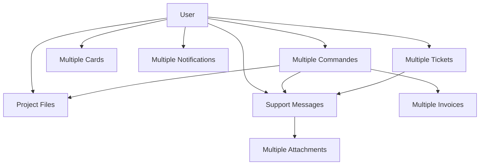

# 🗄️ Guide Complet de la Base de Données - Staka Livres

## 📋 **Vue d'ensemble**

La base de données **Staka Livres** est une architecture complète MySQL 8 gérée par **Prisma ORM** et déployée avec **Docker**. Elle couvre tous les aspects d'une plateforme de correction de manuscrits : utilisateurs, projets, messagerie, support client, facturation automatique et contenu éditorial.

### 🏗️ **Architecture Technique**

- **Base de données** : MySQL 8.4+
- **ORM** : Prisma v6.10.1
- **Environnement** : Docker Compose
- **Port** : 3306 (MySQL), 5555 (Prisma Studio)
- **Container** : `staka_db` (MySQL), `staka_backend` (API + Prisma)
- **Volume persistant** : Données sauvegardées lors des redémarrages

---

## 🎯 **Modèles de Données**

### 👤 **1. User - Utilisateurs**

**Table** : `users`

```prisma
model User {
  id                      String           @id @default(uuid())
  prenom                  String           @db.VarChar(100)
  nom                     String           @db.VarChar(100)
  email                   String           @unique @db.VarChar(255)
  password                String           @db.VarChar(255)        // bcrypt 12 rounds
  role                    Role             @default(USER)          // USER, ADMIN, CORRECTOR
  isActive                Boolean          @default(true)
  avatar                  String?          @db.VarChar(500)        // URL avatar
  telephone               String?          @db.VarChar(20)
  adresse                 String?          @db.Text
  createdAt               DateTime         @default(now())
  updatedAt               DateTime         @updatedAt

  // Relations 1:N
  commandes               Commande[]       // Projets créés
  files                   File[]           // Fichiers uploadés
  sentMessages            Message[]        // Messages envoyés
  receivedMessages        Message[]        // Messages reçus
  notifications           Notification[]   // Notifications reçues
  paymentMethods          PaymentMethod[]  // Cartes de paiement
  supportRequests         SupportRequest[] // Tickets créés
  assignedSupportRequests SupportRequest[] // Tickets assignés (admin)
}
```

**Champs clés :**

- **UUID** : Identifiants sécurisés non-séquentiels
- **email** : Index unique pour connexion
- **password** : Haché avec bcrypt (12 rounds)
- **role** : Gestion des permissions (USER/ADMIN/CORRECTOR)
- **isActive** : Soft delete des comptes

**Index de performance :**

- `users_email_idx` : Connexion rapide
- `users_role_idx` : Filtrage par rôle
- `users_isActive_idx` : Utilisateurs actifs

### 📋 **2. Commande - Projets de Correction**

**Table** : `commandes`

```prisma
model Commande {
  id              String         @id @default(uuid())
  userId          String         // FK vers User
  titre           String         @db.VarChar(255)
  description     String?        @db.Text
  fichierUrl      String?        @db.VarChar(500)        // Legacy, remplacé par File
  statut          StatutCommande @default(EN_ATTENTE)    // Workflow projet
  noteClient      String?        @db.Text                // Notes privées client
  noteCorrecteur  String?        @db.Text                // Notes privées correcteur
  priorite        Priorite       @default(NORMALE)       // Urgence projet
  dateEcheance    DateTime?      // Date limite souhaitée
  dateFinition    DateTime?      // Date de livraison effective
  createdAt       DateTime       @default(now())
  updatedAt       DateTime       @updatedAt

  // Champs Stripe
  paymentStatus   String?        @db.VarChar(50)         // pending, succeeded, failed
  stripeSessionId String?        @db.VarChar(255)        // Session checkout Stripe
  amount          Int?           // Montant en centimes

  // Relations
  user            User           // Propriétaire du projet
  files           File[]         // Fichiers du projet
  invoices        Invoice[]      // Factures générées
  messages        Message[]      // Messages liés au projet
}

enum StatutCommande {
  EN_ATTENTE   // Nouveau projet, en attente d'assignation
  EN_COURS     // Projet assigné, en cours de correction
  TERMINE      // Projet terminé et livré
  ANNULEE      // Projet annulé (remboursement)
  SUSPENDUE    // Projet suspendu temporairement
}

enum Priorite {
  FAIBLE       // Délai flexible
  NORMALE      // Délai standard (7-14 jours)
  HAUTE        // Délai court (3-7 jours)
  URGENTE      // Délai très court (24-72h)
}
```

**Workflow des statuts :**

1. **EN_ATTENTE** → Nouveau projet créé
2. **EN_COURS** → Correcteur assigné, travail commencé
3. **TERMINE** → Livraison effectuée, facture générée
4. **ANNULEE** → Annulation client ou administrateur
5. **SUSPENDUE** → Pause temporaire (problème technique, etc.)

### 🗂️ **3. File - Système de Fichiers**

**Table** : `files`

```prisma
model File {
  id                 String              @id @default(uuid())
  filename           String              @db.VarChar(255)    // Nom original
  storedName         String              @db.VarChar(255)    // UUID + extension
  mimeType           String              @db.VarChar(100)    // Type MIME
  size               Int                 // Taille en octets
  url                String              @db.VarChar(500)    // URL d'accès (S3/local)
  type               FileType            // Catégorie du fichier
  uploadedById       String              // FK vers User
  commandeId         String?             // FK vers Commande (optionnel)
  description        String?             @db.Text            // Description utilisateur
  isPublic           Boolean             @default(false)     // Visibilité publique
  createdAt          DateTime            @default(now())
  updatedAt          DateTime            @updatedAt

  // Relations
  uploadedBy         User                // Utilisateur qui a uploadé
  commande           Commande?           // Projet associé (optionnel)
  messageAttachments MessageAttachment[] // Pièces jointes messages
}

enum FileType {
  DOCUMENT     // .pdf, .doc, .docx, .txt
  IMAGE        // .jpg, .png, .gif (avatars, captures)
  AUDIO        // .mp3, .wav (rare, notes vocales)
  VIDEO        // .mp4, .avi (rare, présentations)
  ARCHIVE      // .zip, .rar (collections de fichiers)
  OTHER        // Types non catégorisés
}
```

**Sécurité et stockage :**

- **storedName** : UUID pour éviter conflits et devinettes
- **Contrôle d'accès** : Seul le propriétaire et les admins peuvent accéder
- **Soft delete** : Fichiers marqués comme supprimés mais conservés
- **Quotas** : Limite de taille par utilisateur (à implémenter)

### 💬 **4. Message - Messagerie Unifiée**

**Table** : `messages`

```prisma
model Message {
  id               String        @id @default(uuid())
  senderId         String        // FK vers User (expéditeur)
  receiverId       String?       // FK vers User (destinataire, optionnel)
  commandeId       String?       // FK vers Commande (conversation projet)
  supportRequestId String?       // FK vers SupportRequest (conversation support)
  subject          String?       @db.VarChar(255)    // Sujet (optionnel)
  content          String        @db.Text            // Contenu du message
  type             MessageType   @default(USER_MESSAGE)
  statut           MessageStatut @default(ENVOYE)
  isRead           Boolean       @default(false)     // Lu par le destinataire
  isArchived       Boolean       @default(false)     // Archivé par l'utilisateur
  isPinned         Boolean       @default(false)     // Épinglé (important)
  parentId         String?       // FK vers Message (réponse)
  threadId         String?       // ID du thread principal
  createdAt        DateTime      @default(now())
  updatedAt        DateTime      @updatedAt

  // Relations
  sender           User          // Expéditeur
  receiver         User?         // Destinataire (optionnel pour broadcast)
  commande         Commande?     // Projet associé
  supportRequest   SupportRequest? // Ticket support associé
  parent           Message?      // Message parent (réponse)
  replies          Message[]     // Réponses à ce message
  attachments      MessageAttachment[] // Pièces jointes
}

enum MessageType {
  USER_MESSAGE     // Message standard utilisateur
  SYSTEM_MESSAGE   // Message automatique du système
  NOTIFICATION     // Notification interne
  SUPPORT_MESSAGE  // Message dans un ticket support
  ADMIN_MESSAGE    // Message administrateur
}

enum MessageStatut {
  BROUILLON        // En cours de rédaction
  ENVOYE           // Envoyé avec succès
  DELIVRE          // Délivré au destinataire
  LU               // Lu par le destinataire
  ARCHIVE          // Archivé
}
```

**Types de conversations :**

1. **Conversation Projet** (`commandeId` renseigné)

   - Client ↔ Correcteur sur un projet spécifique
   - Questions techniques, demandes de clarification
   - Historique lié au projet

2. **Conversation Support** (`supportRequestId` renseigné)

   - Client ↔ Support sur un ticket
   - Problèmes techniques, questions facturation
   - Escalade vers les administrateurs

3. **Message Général** (aucun contexte)
   - Communications directes entre utilisateurs
   - Announcements administrateurs
   - Messages broadcast

### 📎 **5. MessageAttachment - Pièces Jointes**

**Table** : `message_attachments`

```prisma
model MessageAttachment {
  id        String  @id @default(uuid())
  messageId String  // FK vers Message
  fileId    String  // FK vers File

  // Relations
  message   Message // Message contenant la pièce jointe
  file      File    // Fichier attaché

  @@unique([messageId, fileId]) // Un fichier par message maximum
}
```

### 🎫 **6. SupportRequest - Tickets de Support**

**Table** : `support_requests`

```prisma
model SupportRequest {
  id              String               @id @default(uuid())
  userId          String               // FK vers User (créateur)
  title           String               @db.VarChar(255)    // Titre du ticket
  description     String               @db.Text            // Description initiale
  category        SupportCategory      @default(GENERAL)   // Catégorie du problème
  priority        SupportPriority      @default(NORMALE)   // Priorité de traitement
  status          SupportRequestStatus @default(OUVERT)    // Statut du ticket
  assignedToId    String?              // FK vers User (admin assigné)
  source          String?              @db.VarChar(100)    // web, email, phone
  tags            String?              @db.Text            // Tags JSON ou CSV

  // SLA (Service Level Agreement)
  firstResponseAt DateTime?            // Première réponse admin
  resolvedAt      DateTime?            // Date de résolution
  closedAt        DateTime?            // Date de fermeture

  createdAt       DateTime             @default(now())
  updatedAt       DateTime             @updatedAt

  // Relations
  user            User                 // Créateur du ticket
  assignedTo      User?                // Admin assigné
  messages        Message[]            // Messages du ticket support
}

enum SupportCategory {
  GENERAL       // Question générale
  TECHNIQUE     // Problème technique (bug, erreur)
  FACTURATION   // Question sur facture, paiement
  COMMANDE      // Problème avec une commande spécifique
  COMPTE        // Gestion de compte utilisateur
  AUTRE         // Autre sujet non catégorisé
}

enum SupportPriority {
  FAIBLE        // Réponse sous 48h
  NORMALE       // Réponse sous 24h
  HAUTE         // Réponse sous 4h
  URGENTE       // Réponse sous 1h
  CRITIQUE      // Réponse immédiate (système down)
}

enum SupportRequestStatus {
  OUVERT        // Nouveau ticket, en attente de prise en charge
  EN_COURS      // Ticket assigné, en cours de traitement
  EN_ATTENTE    // En attente de réponse client
  RESOLU        // Problème résolu, en attente de confirmation
  FERME         // Ticket fermé définitivement
  ANNULE        // Ticket annulé (doublon, hors scope)
}
```

### 💳 **7. PaymentMethod - Moyens de Paiement Stripe**

**Table** : `payment_methods`

```prisma
model PaymentMethod {
  id                    String   @id @default(uuid())
  userId                String   // FK vers User
  stripePaymentMethodId String   @unique @db.VarChar(255) // ID Stripe
  brand                 String   @db.VarChar(50)          // visa, mastercard, amex
  last4                 String   @db.VarChar(4)           // 4 derniers chiffres
  expMonth              Int      // Mois d'expiration
  expYear               Int      // Année d'expiration
  isDefault             Boolean  @default(false)          // Carte par défaut
  isActive              Boolean  @default(true)           // Carte active
  fingerprint           String?  @db.VarChar(255)         // Fingerprint Stripe
  createdAt             DateTime @default(now())
  updatedAt             DateTime @updatedAt

  // Relations
  user                  User     // Propriétaire de la carte
}
```

**Sécurité PCI :**

- **Aucune donnée sensible** stockée en local
- **Référence Stripe uniquement** via `stripePaymentMethodId`
- **Chiffrement** des communications avec Stripe
- **Webhooks** pour synchronisation des statuts

### 🧾 **8. Invoice - Facturation Automatique**

**Table** : `invoices`

```prisma
model Invoice {
  id         String        @id @default(uuid())
  commandeId String        // FK vers Commande
  number     String        @unique @db.VarChar(50)    // FACT-YYYY-XXXX
  amount     Int           // Montant en centimes
  taxAmount  Int           @default(0)                // TVA en centimes
  pdfUrl     String        @db.VarChar(500)           // URL PDF sur S3
  status     InvoiceStatus @default(GENERATED)        // Statut facture

  // Dates importantes
  issuedAt   DateTime?     // Date d'émission
  dueAt      DateTime?     // Date d'échéance
  paidAt     DateTime?     // Date de paiement

  createdAt  DateTime      @default(now())
  updatedAt  DateTime      @updatedAt

  // Relations
  commande   Commande      // Commande facturée
}

enum InvoiceStatus {
  GENERATED   // Facture générée automatiquement
  SENT        // Facture envoyée au client
  PAID        // Facture payée
  OVERDUE     // Facture en retard de paiement
  CANCELLED   // Facture annulée
}
```

**Processus automatique :**

1. **Génération** : Webhook Stripe "payment succeeded"
2. **PDF** : Génération automatique avec informations complètes
3. **Stockage** : Upload sur S3 avec URL sécurisée
4. **Envoi** : Email automatique au client
5. **Archivage** : Conservation légale 10 ans

### 🔔 **9. Notification - Système de Notifications**

**Table** : `notifications`

```prisma
model Notification {
  id        String               @id @default(uuid())
  userId    String               // FK vers User (destinataire)
  title     String               @db.VarChar(255)    // Titre de la notification
  message   String               @db.Text            // Contenu détaillé
  type      NotificationType     @default(INFO)      // Type de notification
  priority  NotificationPriority @default(NORMALE)   // Priorité d'affichage
  data      String?              @db.Text            // Données JSON additionnelles
  actionUrl String?              @db.VarChar(500)    // URL d'action (bouton)
  isRead    Boolean              @default(false)     // Lu par l'utilisateur
  isDeleted Boolean              @default(false)     // Supprimé par l'utilisateur
  readAt    DateTime?            // Date de lecture
  expiresAt DateTime?            // Date d'expiration (optionnelle)
  createdAt DateTime             @default(now())
  updatedAt DateTime             @updatedAt

  // Relations
  user      User                 // Destinataire
}

enum NotificationType {
  INFO        // Information générale
  SUCCESS     // Confirmation d'action réussie
  WARNING     // Avertissement, attention requise
  ERROR       // Erreur, action requise
  PAYMENT     // Notification de paiement
  ORDER       // Notification de commande
  MESSAGE     // Nouveau message reçu
  SYSTEM      // Notification système
}
```

### 📄 **10. Page - Contenu Éditorial**

**Table** : `pages`

```prisma
model Page {
  id              String     @id @default(uuid())
  title           String     @db.VarChar(255)        // Titre de la page
  slug            String     @unique @db.VarChar(255) // URL slug (/faq, /cgv)
  content         String     @db.LongText            // Contenu HTML/Markdown
  excerpt         String?    @db.Text                // Extrait/résumé
  type            PageType   @default(PAGE)          // Type de page
  status          PageStatus @default(DRAFT)         // Statut de publication

  // SEO
  metaTitle       String?    @db.VarChar(255)        // Titre SEO
  metaDescription String?    @db.Text                // Description SEO
  metaKeywords    String?    @db.Text                // Mots-clés SEO

  // Organisation
  category        String?    @db.VarChar(100)        // Catégorie
  tags            String?    @db.Text                // Tags JSON ou CSV
  sortOrder       Int        @default(0)             // Ordre d'affichage

  // Permissions
  isPublic        Boolean    @default(true)          // Visible publiquement
  requireAuth     Boolean    @default(false)         // Authentification requise
  publishedAt     DateTime?  // Date de publication

  createdAt       DateTime   @default(now())
  updatedAt       DateTime   @updatedAt
}

enum PageType {
  PAGE        // Page standard
  FAQ         // Question fréquente
  BLOG        // Article de blog
  LEGAL       // Page légale (CGV, mentions légales)
  HELP        // Page d'aide
  LANDING     // Page d'atterrissage marketing
}
```

---

## 🔗 **Relations et Contraintes**

### **Relations 1:N (One-to-Many)**



### **Contraintes RGPD et Sécurité**

**Cascade DELETE :**

- `User` supprimé → Toutes ses données supprimées (commandes, messages, fichiers)
- `Commande` supprimée → Fichiers du projet et messages supprimés
- `Message` supprimé → Pièces jointes supprimées

**SET NULL :**

- `SupportRequest` supprimé → `Message.supportRequestId = NULL`
- `User` désactivé → `SupportRequest.assignedToId = NULL`

**Soft Delete :**

- Utilisateurs : `isActive = false`
- Notifications : `isDeleted = true`
- Fichiers : Conservation avec marquage suppression

---

## 🐳 **Utilisation avec Docker et Prisma Studio**

### **1. Démarrage des Services**

```bash
# Démarrer tous les containers
docker-compose up -d

# Vérifier l'état
docker-compose ps

# Logs en temps réel
docker-compose logs -f
```

### **2. Prisma Studio - Interface d'Administration**

```bash
# Lancer Prisma Studio
docker exec -it staka_backend npx prisma studio

# Interface accessible sur : http://localhost:5555
```

**Fonctionnalités Prisma Studio :**

- **Navigation** : Parcourir tous les modèles
- **Visualisation** : Voir les données avec relations
- **Édition** : Modifier/Créer/Supprimer des enregistrements
- **Filtrage** : Rechercher et filtrer les données
- **Relations** : Naviguer entre tables liées
- **Export** : Exporter les données au format JSON

### **3. Commandes de Maintenance**

```bash
# Appliquer les migrations
docker exec -it staka_backend npx prisma migrate deploy

# Générer le client Prisma
docker exec -it staka_backend npx prisma generate

# Synchroniser le schéma (développement uniquement)
docker exec -it staka_backend npx prisma db push

# Réinitialiser la base (ATTENTION : supprime tout)
docker exec -it staka_backend npx prisma migrate reset

# Exporter le schéma depuis la DB
docker exec -it staka_backend npx prisma db pull

# Valider le schéma
docker exec -it staka_backend npx prisma validate

# Formater le schéma
docker exec -it staka_backend npx prisma format
```

### **4. Seed et Données de Test**

```bash
# Charger les données de test
docker exec -it staka_backend npx ts-node scripts/seed.ts

# Contenu des données seed :
# - 2 utilisateurs (admin + user)
# - 3 commandes avec différents statuts
# - 5 messages de conversation
# - 2 tickets de support
# - 3 fichiers exemple
# - 5 notifications
# - 3 pages FAQ
```

**Credentials par défaut :**

- **Admin** : `admin@staka-editions.com` / `admin123`
- **Utilisateur** : `user@example.com` / `user123`

---

## 📊 **Requêtes Prisma Courantes**

### **Utilisateurs et Authentification**

```typescript
// Créer un utilisateur
const user = await prisma.user.create({
  data: {
    prenom: "Jean",
    nom: "Dupont",
    email: "jean.dupont@example.com",
    password: await bcrypt.hash("password123", 12),
    role: "USER",
  },
});

// Connexion utilisateur
const user = await prisma.user.findUnique({
  where: { email: "jean.dupont@example.com" },
  select: { id: true, email: true, password: true, role: true },
});

// Profil utilisateur complet
const profile = await prisma.user.findUnique({
  where: { id: userId },
  include: {
    commandes: { include: { files: true, messages: true } },
    notifications: { where: { isRead: false } },
    paymentMethods: { where: { isActive: true } },
  },
});
```

### **Commandes et Projets**

```typescript
// Créer une commande
const commande = await prisma.commande.create({
  data: {
    userId,
    titre: "Correction Mémoire de Master",
    description: "Mémoire en littérature française...",
    priorite: "NORMALE",
    dateEcheance: new Date("2024-02-15"),
  },
});

// Dashboard admin : commandes par statut
const stats = await prisma.commande.groupBy({
  by: ["statut"],
  _count: { id: true },
  where: { createdAt: { gte: new Date("2024-01-01") } },
});

// Commandes en cours avec détails
const commandesEnCours = await prisma.commande.findMany({
  where: { statut: "EN_COURS" },
  include: {
    user: { select: { prenom: true, nom: true, email: true } },
    files: { select: { filename: true, size: true, createdAt: true } },
    _count: { select: { messages: true } },
  },
  orderBy: { dateEcheance: "asc" },
});
```

### **Messagerie et Support**

```typescript
// Messages d'une conversation projet
const projectMessages = await prisma.message.findMany({
  where: { commandeId: commandeId },
  include: {
    sender: { select: { prenom: true, nom: true, avatar: true } },
    attachments: { include: { file: true } },
  },
  orderBy: { createdAt: "asc" },
});

// Tickets support non assignés
const unassignedTickets = await prisma.supportRequest.findMany({
  where: {
    assignedToId: null,
    status: { in: ["OUVERT", "EN_COURS"] },
  },
  include: {
    user: { select: { prenom: true, nom: true, email: true } },
    _count: { select: { messages: true } },
  },
  orderBy: [{ priority: "desc" }, { createdAt: "asc" }],
});

// Créer un message support
const supportMessage = await prisma.message.create({
  data: {
    senderId: adminId,
    content: "Bonjour, nous examinons votre demande...",
    type: "SUPPORT_MESSAGE",
    supportRequestId: ticketId,
  },
});
```

### **Facturation et Paiements**

```typescript
// Factures d'un utilisateur
const userInvoices = await prisma.invoice.findMany({
  where: {
    commande: { userId: userId },
  },
  include: {
    commande: { select: { titre: true, createdAt: true } },
  },
  orderBy: { createdAt: "desc" },
});

// Générer une facture automatiquement
const invoice = await prisma.invoice.create({
  data: {
    commandeId,
    number: `FACT-${new Date().getFullYear()}-${invoiceNumber}`,
    amount: 59900, // 599.00€ en centimes
    taxAmount: 11980, // 20% TVA
    pdfUrl: pdfUrl,
    status: "GENERATED",
    issuedAt: new Date(),
  },
});

// Statistiques de facturation
const billingStats = await prisma.invoice.aggregate({
  where: {
    createdAt: { gte: startOfMonth },
    status: "PAID",
  },
  _sum: { amount: true },
  _count: { id: true },
});
```

### **Administration et Analytics**

```typescript
// Dashboard admin complet
const dashboard = await Promise.all([
  // Utilisateurs actifs ce mois
  prisma.user.count({
    where: {
      createdAt: { gte: startOfMonth },
      isActive: true,
    },
  }),

  // Commandes par statut
  prisma.commande.groupBy({
    by: ["statut"],
    _count: { id: true },
  }),

  // Chiffre d'affaires du mois
  prisma.invoice.aggregate({
    where: {
      createdAt: { gte: startOfMonth },
      status: "PAID",
    },
    _sum: { amount: true },
  }),

  // Tickets support non résolus
  prisma.supportRequest.count({
    where: { status: { notIn: ["RESOLU", "FERME"] } },
  }),
]);

// Utilisateurs les plus actifs
const activeUsers = await prisma.user.findMany({
  include: {
    _count: {
      select: {
        commandes: true,
        sentMessages: true,
        supportRequests: true,
      },
    },
  },
  orderBy: { commandes: { _count: "desc" } },
  take: 10,
});
```

---

## 🛡️ **Sécurité et Performances**

### **Index de Performance**

```sql
-- Index automatiquement créés par Prisma
CREATE INDEX users_email_idx ON users(email);
CREATE INDEX users_role_idx ON users(role);
CREATE INDEX commandes_userId_idx ON commandes(userId);
CREATE INDEX commandes_statut_idx ON commandes(statut);
CREATE INDEX messages_senderId_idx ON messages(senderId);
CREATE INDEX messages_commandeId_idx ON messages(commandeId);
CREATE INDEX messages_supportRequestId_idx ON messages(supportRequestId);
CREATE INDEX support_requests_userId_idx ON support_requests(userId);
CREATE INDEX invoices_commandeId_idx ON invoices(commandeId);
```

### **Contraintes de Sécurité**

**Niveau Base de Données :**

- **Foreign Keys** avec CASCADE/SET NULL appropriés
- **Contraintes UNIQUE** sur email, stripePaymentMethodId
- **Contraintes CHECK** sur les énumérations
- **Index composites** pour les requêtes complexes

**Niveau Application :**

- **Validation Prisma** avec schéma strict
- **Chiffrement bcrypt** des mots de passe
- **UUID** pour éviter l'énumération
- **Soft delete** pour la conformité RGPD

### **Optimisations de Performance**

```typescript
// Pagination efficace
const messages = await prisma.message.findMany({
  skip: (page - 1) * limit,
  take: limit,
  where: { commandeId },
  include: { sender: { select: { prenom: true, nom: true } } },
  orderBy: { createdAt: "desc" },
});

// Requêtes en lot
const [users, commandes, tickets] = await Promise.all([
  prisma.user.findMany({ take: 10 }),
  prisma.commande.findMany({ take: 10 }),
  prisma.supportRequest.findMany({ take: 10 }),
]);

// Compter efficacement
const userCount = await prisma.user.count({
  where: { isActive: true },
});
```

---

## 🔧 **Maintenance et Administration**

### **Sauvegarde et Restauration**

```bash
# Sauvegarde complète
docker exec staka_db mysqldump -u staka -pstaka stakalivres > backup_$(date +%Y%m%d).sql

# Restauration
docker exec -i staka_db mysql -u staka -pstaka stakalivres < backup_20240125.sql

# Sauvegarde avec Docker volumes
docker run --rm -v staka-livres_db_data:/data -v $(pwd):/backup ubuntu tar czf /backup/db_backup.tar.gz /data
```

### **Monitoring et Logs**

```bash
# Logs de la base de données
docker logs staka_db -f

# Logs du backend Prisma
docker logs staka_backend -f

# Utilisation espace disque
docker exec staka_db du -sh /var/lib/mysql

# Performance de la base
docker exec -it staka_db mysql -u staka -pstaka -e "SHOW PROCESSLIST;"
```

### **Migration en Production**

```bash
# 1. Sauvegarde de sécurité
docker exec staka_db mysqldump -u staka -pstaka stakalivres > prod_backup_pre_migration.sql

# 2. Application des migrations
docker exec -it staka_backend npx prisma migrate deploy

# 3. Vérification de l'intégrité
docker exec -it staka_backend npx prisma validate

# 4. Test de fonctionnement
docker exec -it staka_backend npx prisma studio
```

### **Optimisation et Maintenance**

```sql
-- Analyse des tables
ANALYZE TABLE users, commandes, messages, support_requests;

-- Optimisation des tables
OPTIMIZE TABLE users, commandes, messages;

-- Vérification de l'intégrité
CHECK TABLE users, commandes, messages;

-- Statistiques d'utilisation
SELECT
  table_name,
  table_rows,
  ROUND(data_length / 1024 / 1024, 2) AS data_mb,
  ROUND(index_length / 1024 / 1024, 2) AS index_mb
FROM information_schema.tables
WHERE table_schema = 'stakalivres';
```

---

## 📈 **Métriques et KPIs**

### **Métriques Business**

```typescript
// Chiffre d'affaires mensuel
const monthlyRevenue = await prisma.invoice.aggregate({
  where: {
    createdAt: { gte: startOfMonth, lt: endOfMonth },
    status: "PAID",
  },
  _sum: { amount: true },
});

// Taux de conversion
const conversionRate = await prisma.$queryRaw`
  SELECT 
    COUNT(DISTINCT u.id) as total_users,
    COUNT(DISTINCT c.userId) as users_with_orders,
    ROUND(COUNT(DISTINCT c.userId) * 100.0 / COUNT(DISTINCT u.id), 2) as conversion_rate
  FROM users u
  LEFT JOIN commandes c ON u.id = c.userId
  WHERE u.createdAt >= DATE_SUB(NOW(), INTERVAL 30 DAY)
`;

// Temps de résolution support
const avgResolutionTime = await prisma.$queryRaw`
  SELECT 
    AVG(TIMESTAMPDIFF(HOUR, createdAt, resolvedAt)) as avg_hours
  FROM support_requests 
  WHERE resolvedAt IS NOT NULL
  AND createdAt >= DATE_SUB(NOW(), INTERVAL 30 DAY)
`;
```

### **Métriques Techniques**

```typescript
// Performance des requêtes
const slowQueries = await prisma.$queryRaw`
  SELECT 
    query_time,
    lock_time,
    rows_sent,
    rows_examined,
    sql_text
  FROM mysql.slow_log 
  WHERE start_time >= DATE_SUB(NOW(), INTERVAL 24 HOUR)
  ORDER BY query_time DESC 
  LIMIT 10
`;

// Utilisation de l'espace
const spaceUsage = await prisma.$queryRaw`
  SELECT 
    table_name,
    ROUND(data_length / 1024 / 1024, 2) AS data_mb,
    ROUND(index_length / 1024 / 1024, 2) AS index_mb,
    table_rows
  FROM information_schema.tables 
  WHERE table_schema = 'stakalivres'
  ORDER BY (data_length + index_length) DESC
`;
```

---

## 🚀 **Évolutions et Roadmap**

### **Fonctionnalités Prévues**

1. **Versioning des Fichiers**

   - Historique des modifications
   - Comparaison de versions
   - Rollback automatique

2. **Notifications en Temps Réel**

   - WebSockets pour notifications instantanées
   - Push notifications mobile
   - Emails automatiques personnalisés

3. **Analytics Avancées**

   - Tableaux de bord interactifs
   - Rapports automatisés
   - Prédictions IA

4. **API GraphQL**
   - Alternative à l'API REST
   - Requêtes optimisées
   - Subscriptions temps réel

### **Optimisations Techniques**

1. **Cache Redis**

   - Cache des requêtes fréquentes
   - Sessions utilisateurs
   - Cache de recherche

2. **Partitioning**

   - Partition des messages par date
   - Archives automatiques
   - Performance améliorée

3. **Réplication**
   - Read replicas pour les lectures
   - High availability
   - Load balancing

---

### **Accès Prisma Studio en Production**

```bash
# Tunnel SSH vers le serveur de production
ssh -L 5555:localhost:5555 user@production-server

# Lancer Prisma Studio sur le serveur
npx prisma studio

# Accès via : http://localhost:5555
```

### **Commandes d'Urgence**

```bash
# Redémarrage complet des services
docker-compose restart

# Rebuild complet en cas de problème
docker-compose down -v
docker-compose up --build -d

# Connexion directe à MySQL
docker exec -it staka_db mysql -u staka -pstaka stakalivres

# Logs en temps réel pour debugging
docker-compose logs -f backend db
```

## 🚨 **Troubleshooting - Problèmes Courants**

### **1. Erreur "Column supportRequestId does not exist"**

**Problème** : Lors du seed ou utilisation de l'API, erreur sur la colonne manquante

```
The column `stakalivres.messages.supportRequestId` does not exist
```

**Solution** :

```bash
# 1. Ajouter la colonne manuellement
docker exec -it staka_db mysql -u staka -pstaka stakalivres -e "ALTER TABLE messages ADD COLUMN supportRequestId VARCHAR(191) NULL;"

# 2. Créer l'index et la contrainte
docker exec -it staka_db mysql -u staka -pstaka stakalivres -e "CREATE INDEX messages_supportRequestId_idx ON messages(supportRequestId); ALTER TABLE messages ADD CONSTRAINT messages_supportRequestId_fkey FOREIGN KEY (supportRequestId) REFERENCES support_requests(id) ON DELETE SET NULL;"

# 3. Régénérer le client Prisma
docker exec -it staka_backend npx prisma generate
```

### **2. Erreur "Property 'number' is missing" sur Invoice**

**Problème** : Erreur TypeScript lors de la création de factures

```
Property 'number' is missing in type 'InvoiceUncheckedCreateInput'
```

**Solution** : Vérifier que toutes les créations d'Invoice incluent le champ `number` :

```typescript
const invoice = await prisma.invoice.create({
  data: {
    commandeId,
    number: `FACT-${new Date().getFullYear()}-${Date.now()
      .toString()
      .slice(-6)}`,
    amount: 59900,
    pdfUrl,
    status: "GENERATED",
    issuedAt: new Date(),
  },
});
```

### **3. Erreur "Could not find migration file"**

**Problème** : Dossiers de migration vides ou corrompus

```
Could not find the migration file at migration.sql
```

**Solution** :

```bash
# 1. Supprimer les dossiers de migration vides
rm -rf backend/prisma/migrations/[dossier-vide]

# 2. Forcer la résolution de la migration
docker exec -it staka_backend npx prisma migrate resolve --applied [migration-name]

# 3. Redéployer les migrations
docker exec -it staka_backend npx prisma migrate deploy
```

### **4. Backend qui crash au démarrage**

**Problème** : Le backend ne démarre pas, erreurs TypeScript

**Diagnostic** :

```bash
# Vérifier les logs du backend
docker logs staka_backend --tail 50

# Vérifier l'état des containers
docker-compose ps
```

**Solutions communes** :

```bash
# 1. Régénérer le client Prisma
docker exec -it staka_backend npx prisma generate

# 2. Redémarrer le container backend
docker-compose restart backend

# 3. Rebuild complet si nécessaire
docker-compose up --build -d backend
```

### **5. Erreur de connexion "ERR_CONNECTION_RESET"**

**Problème** : Le frontend ne peut pas se connecter au backend

**Vérifications** :

```bash
# 1. Tester si l'API répond
curl -X GET http://localhost:3001/health

# 2. Vérifier que le backend écoute sur le bon port
docker exec -it staka_backend netstat -tlnp | grep 3001

# 3. Vérifier les variables d'environnement
docker exec -it staka_backend env | grep -E "PORT|DATABASE_URL"
```

### **6. Base de données vide après migration**

**Problème** : Les tables ne sont pas créées après migration

**Solution** :

```bash
# 1. Vérifier l'état des migrations
docker exec -it staka_backend npx prisma migrate status

# 2. Appliquer toutes les migrations
docker exec -it staka_backend npx prisma migrate deploy

# 3. Vérifier que les tables existent
docker exec -it staka_db mysql -u staka -pstaka stakalivres -e "SHOW TABLES;"
```

### **7. Prisma Studio ne démarre pas**

**Problème** : Impossible d'accéder à Prisma Studio sur localhost:5555

**Solution** :

```bash
# 1. Vérifier que le port n'est pas occupé
lsof -i :5555

# 2. Lancer Prisma Studio en mode debug
docker exec -it staka_backend npx prisma studio --browser none --port 5555

# 3. Accéder via l'IP du container
docker inspect staka_backend | grep IPAddress
```

### **8. Permissions de fichiers Docker**

**Problème** : Erreurs de permissions lors de l'écriture de fichiers

**Solution** :

```bash
# Changer le propriétaire des volumes
sudo chown -R $USER:$USER backend/prisma/migrations
sudo chown -R $USER:$USER backend/scripts

# Ou utiliser un utilisateur Docker spécifique
docker exec -u root -it staka_backend chown -R node:node /app
```

### **Contacts Techniques**

- **Documentation Prisma** : https://prisma.io/docs
- **Docker Compose** : https://docs.docker.com/compose
- **MySQL 8** : https://dev.mysql.com/doc/refman/8.0/

## ✅ **Checklist de Vérification - Base de Données Fonctionnelle**

### **État Global des Services**

```bash
# 1. Tous les containers sont démarrés
docker-compose ps
# Résultat attendu : staka_backend, staka_db, staka_frontend UP

# 2. Backend répond sur l'API de santé
curl -X GET http://localhost:3001/health
# Résultat attendu : {"status":"OK","timestamp":"..."}

# 3. Base de données accessible
docker exec -it staka_db mysql -u staka -pstaka stakalivres -e "SELECT 1;"
# Résultat attendu : 1

# 4. Prisma Studio accessible
docker exec -it staka_backend npx prisma studio --browser none
# Puis ouvrir : http://localhost:5555
```

### **Vérification des Données Seed**

```bash
# 5. Utilisateurs créés
docker exec -it staka_db mysql -u staka -pstaka stakalivres -e "SELECT email, role FROM users;"
# Résultat attendu : admin@staka-editions.com (ADMIN), user@example.com (USER)

# 6. Tables principales peuplées
docker exec -it staka_db mysql -u staka -pstaka stakalivres -e "
SELECT
  'users' as table_name, COUNT(*) as count FROM users
UNION SELECT 'commandes', COUNT(*) FROM commandes
UNION SELECT 'messages', COUNT(*) FROM messages
UNION SELECT 'support_requests', COUNT(*) FROM support_requests;"
```

### **Test de Connexion Complet**

```bash
# 7. Test de login API
curl -X POST http://localhost:3001/auth/login \
  -H "Content-Type: application/json" \
  -d '{"email": "admin@staka-editions.com", "password": "admin123"}'
# Résultat attendu : {"message":"Connexion réussie","user":{...},"token":"..."}
```

### **Indicateurs de Performance**

```bash
# 8. Utilisation mémoire containers
docker stats --no-stream --format "table {{.Container}}\t{{.CPUPerc}}\t{{.MemUsage}}"

# 9. Espace disque base de données
docker exec staka_db du -sh /var/lib/mysql
```

---

## 📝 **Changelog - Dernières Corrections**

**Version 1.1 - Juin 2025**

- ✅ Correction champ `number` obligatoire dans modèle Invoice
- ✅ Ajout colonne `supportRequestId` dans table messages avec contraintes FK
- ✅ Export default app dans server.ts pour compatibilité tests
- ✅ Suppression dossiers migrations vides causant échecs deploy
- ✅ Credentials par défaut seed documentés
- ✅ Section troubleshooting complète ajoutée

**Version 1.0 - Juin 2025**

- 🎯 Schéma complet 10 modèles (User, Commande, File, Message, SupportRequest, PaymentMethod, Invoice, Notification, Page, MessageAttachment)
- 🔗 Relations complexes avec contraintes RGPD
- 🐳 Déploiement Docker avec Prisma Studio
- 📊 Exemples requêtes et métriques business
- 🛡️ Sécurité et optimisations performance

---

_Version Base de Données : MySQL 8.4+ avec Prisma v6.10.1_
