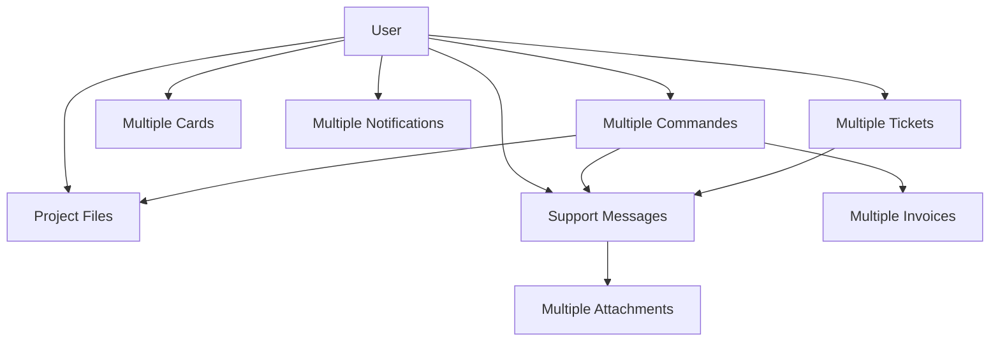

# 🗄️ Guide Complet de la Base de Données - Staka Livres

## 📋 **Vue d'ensemble**

La base de données **Staka Livres** est une architecture complète MySQL 8 gérée par **Prisma ORM** et déployée avec **Docker**. Elle couvre tous les aspects d'une plateforme de correction de manuscrits : utilisateurs, projets, messagerie, support client, facturation automatique et contenu éditorial.

### 🏗️ **Architecture Technique - Version 2025**

- **Base de données** : MySQL 8.4+
- **ORM** : Prisma v6.10.1 ⚡ (dernière version)
- **Environnement** : Docker Compose
- **Port** : 3306 (MySQL), 5555 (Prisma Studio)
- **Container** : `staka_db` (MySQL), `staka_backend` (API + Prisma)
- **Volume persistant** : Données sauvegardées lors des redémarrages
- **API endpoints** : **46+ endpoints** dont 16 endpoints admin opérationnels

### 🆕 **Dernières Évolutions 2025**

- ✅ **Module Admin Users complet** : 7 endpoints opérationnels avec CRUD complet
- ✅ **Module Admin Commandes enrichi** : 4 endpoints avec modale détails moderne
- ✅ **Messagerie Admin migrée** : 9 endpoints backend réels (fini les mocks)
- ✅ **Types TypeScript unifiés** : Alignement parfait frontend ↔ backend
- ✅ **Suppression RGPD complète** : Transactions sécurisées pour effacement définitif
- ✅ **Protection admin** : Dernier administrateur actif protégé contre suppression
- ✅ **Dashboard stats avancées** : Métriques calculées depuis vraies données DB

---

## 🎯 **Modèles de Données**

### 👤 **1. User - Utilisateurs**

**Table** : `users`

```prisma
model User {
  id                      String           @id @default(uuid())
  prenom                  String           @db.VarChar(100)
  nom                     String           @db.VarChar(100)
  email                   String           @unique @db.VarChar(255)
  password                String           @db.VarChar(255)        // bcrypt 12 rounds
  role                    Role             @default(USER)          // USER, ADMIN, CORRECTOR
  isActive                Boolean          @default(true)
  avatar                  String?          @db.VarChar(500)        // URL avatar
  telephone               String?          @db.VarChar(20)
  adresse                 String?          @db.Text
  createdAt               DateTime         @default(now())
  updatedAt               DateTime         @updatedAt

  // Relations 1:N
  commandes               Commande[]       // Projets créés
  files                   File[]           // Fichiers uploadés
  sentMessages            Message[]        // Messages envoyés
  receivedMessages        Message[]        // Messages reçus
  notifications           Notification[]   // Notifications reçues
  paymentMethods          PaymentMethod[]  // Cartes de paiement
  supportRequests         SupportRequest[] // Tickets créés
  assignedSupportRequests SupportRequest[] // Tickets assignés (admin)
}
```

**Champs clés :**

- **UUID** : Identifiants sécurisés non-séquentiels
- **email** : Index unique pour connexion
- **password** : Haché avec bcrypt (12 rounds)
- **role** : Gestion des permissions (USER/ADMIN/CORRECTOR)
- **isActive** : Soft delete des comptes

**Index de performance :**

- `users_email_idx` : Connexion rapide
- `users_role_idx` : Filtrage par rôle
- `users_isActive_idx` : Utilisateurs actifs

### 📋 **2. Commande - Projets de Correction**

**Table** : `commandes`

```prisma
model Commande {
  id              String         @id @default(uuid())
  userId          String         // FK vers User
  titre           String         @db.VarChar(255)
  description     String?        @db.Text
  fichierUrl      String?        @db.VarChar(500)        // Legacy, remplacé par File
  statut          StatutCommande @default(EN_ATTENTE)    // Workflow projet
  noteClient      String?        @db.Text                // Notes privées client
  noteCorrecteur  String?        @db.Text                // Notes privées correcteur
  priorite        Priorite       @default(NORMALE)       // Urgence projet
  dateEcheance    DateTime?      // Date limite souhaitée
  dateFinition    DateTime?      // Date de livraison effective
  createdAt       DateTime       @default(now())
  updatedAt       DateTime       @updatedAt

  // Champs Stripe
  paymentStatus   String?        @db.VarChar(50)         // pending, succeeded, failed
  stripeSessionId String?        @db.VarChar(255)        // Session checkout Stripe
  amount          Int?           // Montant en centimes

  // Relations
  user            User           // Propriétaire du projet
  files           File[]         // Fichiers du projet
  invoices        Invoice[]      // Factures générées
  messages        Message[]      // Messages liés au projet
}

enum StatutCommande {
  EN_ATTENTE   // Nouveau projet, en attente d'assignation
  EN_COURS     // Projet assigné, en cours de correction
  TERMINE      // Projet terminé et livré
  ANNULEE      // Projet annulé (remboursement)
  SUSPENDUE    // Projet suspendu temporairement
}

enum Priorite {
  FAIBLE       // Délai flexible
  NORMALE      // Délai standard (7-14 jours)
  HAUTE        // Délai court (3-7 jours)
  URGENTE      // Délai très court (24-72h)
}
```

**Workflow des statuts :**

1. **EN_ATTENTE** → Nouveau projet créé
2. **EN_COURS** → Correcteur assigné, travail commencé
3. **TERMINE** → Livraison effectuée, facture générée
4. **ANNULEE** → Annulation client ou administrateur
5. **SUSPENDUE** → Pause temporaire (problème technique, etc.)

### 🗂️ **3. File - Système de Fichiers**

**Table** : `files`

```prisma
model File {
  id                 String              @id @default(uuid())
  filename           String              @db.VarChar(255)    // Nom original
  storedName         String              @db.VarChar(255)    // UUID + extension
  mimeType           String              @db.VarChar(100)    // Type MIME
  size               Int                 // Taille en octets
  url                String              @db.VarChar(500)    // URL d'accès (S3/local)
  type               FileType            // Catégorie du fichier
  uploadedById       String              // FK vers User
  commandeId         String?             // FK vers Commande (optionnel)
  description        String?             @db.Text            // Description utilisateur
  isPublic           Boolean             @default(false)     // Visibilité publique
  createdAt          DateTime            @default(now())
  updatedAt          DateTime            @updatedAt

  // Relations
  uploadedBy         User                // Utilisateur qui a uploadé
  commande           Commande?           // Projet associé (optionnel)
  messageAttachments MessageAttachment[] // Pièces jointes messages
}

enum FileType {
  DOCUMENT     // .pdf, .doc, .docx, .txt
  IMAGE        // .jpg, .png, .gif (avatars, captures)
  AUDIO        // .mp3, .wav (rare, notes vocales)
  VIDEO        // .mp4, .avi (rare, présentations)
  ARCHIVE      // .zip, .rar (collections de fichiers)
  OTHER        // Types non catégorisés
}
```

**Sécurité et stockage :**

- **storedName** : UUID pour éviter conflits et devinettes
- **Contrôle d'accès** : Seul le propriétaire et les admins peuvent accéder
- **Soft delete** : Fichiers marqués comme supprimés mais conservés
- **Quotas** : Limite de taille par utilisateur (à implémenter)

### 💬 **4. Message - Messagerie Unifiée**

**Table** : `messages`

```prisma
model Message {
  id               String        @id @default(uuid())
  senderId         String        // FK vers User (expéditeur)
  receiverId       String?       // FK vers User (destinataire, optionnel)
  commandeId       String?       // FK vers Commande (conversation projet)
  supportRequestId String?       // FK vers SupportRequest (conversation support)
  subject          String?       @db.VarChar(255)    // Sujet (optionnel)
  content          String        @db.Text            // Contenu du message
  type             MessageType   @default(USER_MESSAGE)
  statut           MessageStatut @default(ENVOYE)
  isRead           Boolean       @default(false)     // Lu par le destinataire
  isArchived       Boolean       @default(false)     // Archivé par l'utilisateur
  isPinned         Boolean       @default(false)     // Épinglé (important)
  parentId         String?       // FK vers Message (réponse)
  threadId         String?       // ID du thread principal
  createdAt        DateTime      @default(now())
  updatedAt        DateTime      @updatedAt

  // Relations
  sender           User          // Expéditeur
  receiver         User?         // Destinataire (optionnel pour broadcast)
  commande         Commande?     // Projet associé
  supportRequest   SupportRequest? // Ticket support associé
  parent           Message?      // Message parent (réponse)
  replies          Message[]     // Réponses à ce message
  attachments      MessageAttachment[] // Pièces jointes
}

enum MessageType {
  USER_MESSAGE     // Message standard utilisateur
  SYSTEM_MESSAGE   // Message automatique du système
  NOTIFICATION     // Notification interne
  SUPPORT_MESSAGE  // Message dans un ticket support
  ADMIN_MESSAGE    // Message administrateur
}

enum MessageStatut {
  BROUILLON        // En cours de rédaction
  ENVOYE           // Envoyé avec succès
  DELIVRE          // Délivré au destinataire
  LU               // Lu par le destinataire
  ARCHIVE          // Archivé
}
```

**Types de conversations :**

1. **Conversation Projet** (`commandeId` renseigné)

   - Client ↔ Correcteur sur un projet spécifique
   - Questions techniques, demandes de clarification
   - Historique lié au projet

2. **Conversation Support** (`supportRequestId` renseigné)

   - Client ↔ Support sur un ticket
   - Problèmes techniques, questions facturation
   - Escalade vers les administrateurs

3. **Message Général** (aucun contexte)
   - Communications directes entre utilisateurs
   - Announcements administrateurs
   - Messages broadcast

### 📎 **5. MessageAttachment - Pièces Jointes**

**Table** : `message_attachments`

```prisma
model MessageAttachment {
  id        String  @id @default(uuid())
  messageId String  // FK vers Message
  fileId    String  // FK vers File

  // Relations
  message   Message // Message contenant la pièce jointe
  file      File    // Fichier attaché

  @@unique([messageId, fileId]) // Un fichier par message maximum
}
```

### 🎫 **6. SupportRequest - Tickets de Support**

**Table** : `support_requests`

```prisma
model SupportRequest {
  id              String               @id @default(uuid())
  userId          String               // FK vers User (créateur)
  title           String               @db.VarChar(255)    // Titre du ticket
  description     String               @db.Text            // Description initiale
  category        SupportCategory      @default(GENERAL)   // Catégorie du problème
  priority        SupportPriority      @default(NORMALE)   // Priorité de traitement
  status          SupportRequestStatus @default(OUVERT)    // Statut du ticket
  assignedToId    String?              // FK vers User (admin assigné)
  source          String?              @db.VarChar(100)    // web, email, phone
  tags            String?              @db.Text            // Tags JSON ou CSV

  // SLA (Service Level Agreement)
  firstResponseAt DateTime?            // Première réponse admin
  resolvedAt      DateTime?            // Date de résolution
  closedAt        DateTime?            // Date de fermeture

  createdAt       DateTime             @default(now())
  updatedAt       DateTime             @updatedAt

  // Relations
  user            User                 // Créateur du ticket
  assignedTo      User?                // Admin assigné
  messages        Message[]            // Messages du ticket support
}

enum SupportCategory {
  GENERAL       // Question générale
  TECHNIQUE     // Problème technique (bug, erreur)
  FACTURATION   // Question sur facture, paiement
  COMMANDE      // Problème avec une commande spécifique
  COMPTE        // Gestion de compte utilisateur
  AUTRE         // Autre sujet non catégorisé
}

enum SupportPriority {
  FAIBLE        // Réponse sous 48h
  NORMALE       // Réponse sous 24h
  HAUTE         // Réponse sous 4h
  URGENTE       // Réponse sous 1h
  CRITIQUE      // Réponse immédiate (système down)
}

enum SupportRequestStatus {
  OUVERT        // Nouveau ticket, en attente de prise en charge
  EN_COURS      // Ticket assigné, en cours de traitement
  EN_ATTENTE    // En attente de réponse client
  RESOLU        // Problème résolu, en attente de confirmation
  FERME         // Ticket fermé définitivement
  ANNULE        // Ticket annulé (doublon, hors scope)
}
```

### 💳 **7. PaymentMethod - Moyens de Paiement Stripe**

**Table** : `payment_methods`

```prisma
model PaymentMethod {
  id                    String   @id @default(uuid())
  userId                String   // FK vers User
  stripePaymentMethodId String   @unique @db.VarChar(255) // ID Stripe
  brand                 String   @db.VarChar(50)          // visa, mastercard, amex
  last4                 String   @db.VarChar(4)           // 4 derniers chiffres
  expMonth              Int      // Mois d'expiration
  expYear               Int      // Année d'expiration
  isDefault             Boolean  @default(false)          // Carte par défaut
  isActive              Boolean  @default(true)           // Carte active
  fingerprint           String?  @db.VarChar(255)         // Fingerprint Stripe
  createdAt             DateTime @default(now())
  updatedAt             DateTime @updatedAt

  // Relations
  user                  User     // Propriétaire de la carte
}
```

**Sécurité PCI :**

- **Aucune donnée sensible** stockée en local
- **Référence Stripe uniquement** via `stripePaymentMethodId`
- **Chiffrement** des communications avec Stripe
- **Webhooks** pour synchronisation des statuts

### 🧾 **8. Invoice - Facturation Automatique**

**Table** : `invoices`

```prisma
model Invoice {
  id         String        @id @default(uuid())
  commandeId String        // FK vers Commande
  number     String        @unique @db.VarChar(50)    // FACT-YYYY-XXXX
  amount     Int           // Montant en centimes
  taxAmount  Int           @default(0)                // TVA en centimes
  pdfUrl     String        @db.VarChar(500)           // URL PDF sur S3
  status     InvoiceStatus @default(GENERATED)        // Statut facture

  // Dates importantes
  issuedAt   DateTime?     // Date d'émission
  dueAt      DateTime?     // Date d'échéance
  paidAt     DateTime?     // Date de paiement

  createdAt  DateTime      @default(now())
  updatedAt  DateTime      @updatedAt

  // Relations
  commande   Commande      // Commande facturée
}

enum InvoiceStatus {
  GENERATED   // Facture générée automatiquement
  SENT        // Facture envoyée au client
  PAID        // Facture payée
  OVERDUE     // Facture en retard de paiement
  CANCELLED   // Facture annulée
}
```

**Processus automatique :**

1. **Génération** : Webhook Stripe "payment succeeded"
2. **PDF** : Génération automatique avec informations complètes
3. **Stockage** : Upload sur S3 avec URL sécurisée
4. **Envoi** : Email automatique au client
5. **Archivage** : Conservation légale 10 ans

### 🔔 **9. Notification - Système de Notifications**

**Table** : `notifications`

```prisma
model Notification {
  id        String               @id @default(uuid())
  userId    String               // FK vers User (destinataire)
  title     String               @db.VarChar(255)    // Titre de la notification
  message   String               @db.Text            // Contenu détaillé
  type      NotificationType     @default(INFO)      // Type de notification
  priority  NotificationPriority @default(NORMALE)   // Priorité d'affichage
  data      String?              @db.Text            // Données JSON additionnelles
  actionUrl String?              @db.VarChar(500)    // URL d'action (bouton)
  isRead    Boolean              @default(false)     // Lu par l'utilisateur
  isDeleted Boolean              @default(false)     // Supprimé par l'utilisateur
  readAt    DateTime?            // Date de lecture
  expiresAt DateTime?            // Date d'expiration (optionnelle)
  createdAt DateTime             @default(now())
  updatedAt DateTime             @updatedAt

  // Relations
  user      User                 // Destinataire
}

enum NotificationType {
  INFO        // Information générale
  SUCCESS     // Confirmation d'action réussie
  WARNING     // Avertissement, attention requise
  ERROR       // Erreur, action requise
  PAYMENT     // Notification de paiement
  ORDER       // Notification de commande
  MESSAGE     // Nouveau message reçu
  SYSTEM      // Notification système
}
```

### 📄 **10. Page - Contenu Éditorial**

**Table** : `pages`

```prisma
model Page {
  id              String     @id @default(uuid())
  title           String     @db.VarChar(255)        // Titre de la page
  slug            String     @unique @db.VarChar(255) // URL slug (/faq, /cgv)
  content         String     @db.LongText            // Contenu HTML/Markdown
  excerpt         String?    @db.Text                // Extrait/résumé
  type            PageType   @default(PAGE)          // Type de page
  status          PageStatus @default(DRAFT)         // Statut de publication

  // SEO
  metaTitle       String?    @db.VarChar(255)        // Titre SEO
  metaDescription String?    @db.Text                // Description SEO
  metaKeywords    String?    @db.Text                // Mots-clés SEO

  // Organisation
  category        String?    @db.VarChar(100)        // Catégorie
  tags            String?    @db.Text                // Tags JSON ou CSV
  sortOrder       Int        @default(0)             // Ordre d'affichage

  // Permissions
  isPublic        Boolean    @default(true)          // Visible publiquement
  requireAuth     Boolean    @default(false)         // Authentification requise
  publishedAt     DateTime?  // Date de publication

  createdAt       DateTime   @default(now())
  updatedAt       DateTime   @updatedAt
}

enum PageType {
  PAGE        // Page standard
  FAQ         // Question fréquente
  BLOG        // Article de blog
  LEGAL       // Page légale (CGV, mentions légales)
  HELP        // Page d'aide
  LANDING     // Page d'atterrissage marketing
}
```

---

## 🔗 **Relations et Contraintes**

### **Relations 1:N (One-to-Many)**



### **Contraintes RGPD et Sécurité**

**Cascade DELETE :**

- `User` supprimé → Toutes ses données supprimées (commandes, messages, fichiers)
- `Commande` supprimée → Fichiers du projet et messages supprimés
- `Message` supprimé → Pièces jointes supprimées

**SET NULL :**

- `SupportRequest` supprimé → `Message.supportRequestId = NULL`
- `User` désactivé → `SupportRequest.assignedToId = NULL`

**Soft Delete :**

- Utilisateurs : `isActive = false`
- Notifications : `isDeleted = true`
- Fichiers : Conservation avec marquage suppression

---

## 🐳 **Utilisation avec Docker et Prisma Studio**

### **1. Démarrage des Services**

```bash
# Démarrer tous les containers
docker-compose up -d

# Vérifier l'état
docker-compose ps

# Logs en temps réel
docker-compose logs -f
```

### **2. Prisma Studio - Interface d'Administration**

```bash
# Lancer Prisma Studio
docker exec -it staka_backend npx prisma studio

# Interface accessible sur : http://localhost:5555
```

**Fonctionnalités Prisma Studio :**

- **Navigation** : Parcourir tous les modèles
- **Visualisation** : Voir les données avec relations
- **Édition** : Modifier/Créer/Supprimer des enregistrements
- **Filtrage** : Rechercher et filtrer les données
- **Relations** : Naviguer entre tables liées
- **Export** : Exporter les données au format JSON

### **3. Commandes de Maintenance**

```bash
# Appliquer les migrations
docker exec -it staka_backend npx prisma migrate deploy

# Générer le client Prisma
docker exec -it staka_backend npx prisma generate

# Synchroniser le schéma (développement uniquement)
docker exec -it staka_backend npx prisma db push

# Réinitialiser la base (ATTENTION : supprime tout)
docker exec -it staka_backend npx prisma migrate reset

# Exporter le schéma depuis la DB
docker exec -it staka_backend npx prisma db pull

# Valider le schéma
docker exec -it staka_backend npx prisma validate

# Formater le schéma
docker exec -it staka_backend npx prisma format
```

### **4. Seed et Données de Test**

```bash
# Charger les données de test
docker exec -it staka_backend npx ts-node scripts/seed.ts

# Contenu des données seed :
# - 2 utilisateurs (admin + user)
# - 3 commandes avec différents statuts
# - 5 messages de conversation
# - 2 tickets de support
# - 3 fichiers exemple
# - 5 notifications
# - 3 pages FAQ
```

**Credentials par défaut :**

- **Admin** : `admin@staka-editions.com` / `admin123`
- **Utilisateur** : `user@example.com` / `user123`

---

## 📊 **Requêtes Prisma Courantes**

### **Utilisateurs et Authentification**

```typescript
// Créer un utilisateur
const user = await prisma.user.create({
  data: {
    prenom: "Jean",
    nom: "Dupont",
    email: "jean.dupont@example.com",
    password: await bcrypt.hash("password123", 12),
    role: "USER",
  },
});

// Connexion utilisateur
const user = await prisma.user.findUnique({
  where: { email: "jean.dupont@example.com" },
  select: { id: true, email: true, password: true, role: true },
});

// Profil utilisateur complet
const profile = await prisma.user.findUnique({
  where: { id: userId },
  include: {
    commandes: { include: { files: true, messages: true } },
    notifications: { where: { isRead: false } },
    paymentMethods: { where: { isActive: true } },
  },
});
```

### **Commandes et Projets**

```typescript
// Créer une commande
const commande = await prisma.commande.create({
  data: {
    userId,
    titre: "Correction Mémoire de Master",
    description: "Mémoire en littérature française...",
    priorite: "NORMALE",
    dateEcheance: new Date("2024-02-15"),
  },
});

// Dashboard admin : commandes par statut
const stats = await prisma.commande.groupBy({
  by: ["statut"],
  _count: { id: true },
  where: { createdAt: { gte: new Date("2024-01-01") } },
});

// Commandes en cours avec détails
const commandesEnCours = await prisma.commande.findMany({
  where: { statut: "EN_COURS" },
  include: {
    user: { select: { prenom: true, nom: true, email: true } },
    files: { select: { filename: true, size: true, createdAt: true } },
    _count: { select: { messages: true } },
  },
  orderBy: { dateEcheance: "asc" },
});
```

### **Messagerie et Support**

```typescript
// Messages d'une conversation projet
const projectMessages = await prisma.message.findMany({
  where: { commandeId: commandeId },
  include: {
    sender: { select: { prenom: true, nom: true, avatar: true } },
    attachments: { include: { file: true } },
  },
  orderBy: { createdAt: "asc" },
});

// Tickets support non assignés
const unassignedTickets = await prisma.supportRequest.findMany({
  where: {
    assignedToId: null,
    status: { in: ["OUVERT", "EN_COURS"] },
  },
  include: {
    user: { select: { prenom: true, nom: true, email: true } },
    _count: { select: { messages: true } },
  },
  orderBy: [{ priority: "desc" }, { createdAt: "asc" }],
});

// Créer un message support
const supportMessage = await prisma.message.create({
  data: {
    senderId: adminId,
    content: "Bonjour, nous examinons votre demande...",
    type: "SUPPORT_MESSAGE",
    supportRequestId: ticketId,
  },
});

// 🆕 NOUVEAUX ENDPOINTS ADMIN - Messagerie Admin

// Grouper messages en conversations pour admin
const groupMessagesIntoConversations = (messages: Message[]) => {
  const conversationsMap = new Map();

  messages.forEach((message) => {
    let conversationId: string;

    if (message.commandeId) {
      conversationId = `projet_${message.commandeId}`;
    } else if (message.supportRequestId) {
      conversationId = `support_${message.supportRequestId}`;
    } else {
      // Conversation directe
      const userIds = [message.senderId, message.receiverId]
        .filter(Boolean)
        .sort();
      conversationId = `direct_${userIds.join("_")}`;
    }

    if (!conversationsMap.has(conversationId)) {
      conversationsMap.set(conversationId, {
        id: conversationId,
        type: message.commandeId
          ? "projet"
          : message.supportRequestId
          ? "support"
          : "direct",
        messages: [],
        participants: [], // À remplir selon le contexte
        messageCount: 0,
        unreadCount: 0,
        lastMessage: null,
      });
    }

    const conversation = conversationsMap.get(conversationId);
    conversation.messages.push(message);
    conversation.messageCount++;
    if (!message.isRead) conversation.unreadCount++;

    if (
      !conversation.lastMessage ||
      message.createdAt > conversation.lastMessage.createdAt
    ) {
      conversation.lastMessage = {
        content: message.content,
        createdAt: message.createdAt,
        sender:
          message.sender?.prenom + " " + message.sender?.nom || "Utilisateur",
      };
    }
  });

  return Array.from(conversationsMap.values());
};

// Parser conversation ID pour identifier destinataire (messages admin)
const parseConversationId = async (conversationId: string, adminId: string) => {
  let receiverId = null;
  let commandeId = null;
  let supportRequestId = null;

  if (conversationId.startsWith("direct_")) {
    // Conversation directe : extraire l'autre utilisateur
    const parts = conversationId.split("_");
    for (let i = 1; i < parts.length; i++) {
      if (parts[i] !== adminId) {
        receiverId = parts[i];
        break;
      }
    }
  } else if (conversationId.startsWith("projet_")) {
    // Conversation projet : récupérer le propriétaire
    commandeId = conversationId.replace("projet_", "");
    const commande = await prisma.commande.findUnique({
      where: { id: commandeId },
      select: { userId: true },
    });
    receiverId = commande?.userId;
  } else if (conversationId.startsWith("support_")) {
    // Conversation support : récupérer le créateur du ticket
    supportRequestId = conversationId.replace("support_", "");
    const supportRequest = await prisma.supportRequest.findUnique({
      where: { id: supportRequestId },
      select: { userId: true },
    });
    receiverId = supportRequest?.userId;
  }

  return { receiverId, commandeId, supportRequestId };
};

// Statistiques avancées pour dashboard admin
const getAdvancedStats = async () => {
  const [
    totalCommandes,
    totalFactures,
    totalUtilisateurs,
    totalMessages,
    messagesNonLus,
    commandesEnCours,
    facturesEnAttente,
    utilisateursActifs,
  ] = await Promise.all([
    prisma.commande.count(),
    prisma.invoice.count(),
    prisma.user.count({ where: { isActive: true } }),
    prisma.message.count(),
    prisma.message.count({ where: { isRead: false } }),
    prisma.commande.count({ where: { statut: "EN_COURS" } }),
    prisma.invoice.count({ where: { status: "GENERATED" } }),
    prisma.user.count({
      where: {
        isActive: true,
        createdAt: { gte: new Date(Date.now() - 30 * 24 * 60 * 60 * 1000) },
      },
    }),
  ]);

  return {
    totalCommandes,
    totalFactures,
    totalUtilisateurs,
    totalMessages,
    messagesNonLus,
    commandesEnCours,
    facturesEnAttente,
    utilisateursActifs,
  };
};
```

### **Facturation et Paiements**

```typescript
// Factures d'un utilisateur
const userInvoices = await prisma.invoice.findMany({
  where: {
    commande: { userId: userId },
  },
  include: {
    commande: { select: { titre: true, createdAt: true } },
  },
  orderBy: { createdAt: "desc" },
});

// Générer une facture automatiquement
const invoice = await prisma.invoice.create({
  data: {
    commandeId,
    number: `FACT-${new Date().getFullYear()}-${invoiceNumber}`,
    amount: 59900, // 599.00€ en centimes
    taxAmount: 11980, // 20% TVA
    pdfUrl: pdfUrl,
    status: "GENERATED",
    issuedAt: new Date(),
  },
});

// Statistiques de facturation
const billingStats = await prisma.invoice.aggregate({
  where: {
    createdAt: { gte: startOfMonth },
    status: "PAID",
  },
  _sum: { amount: true },
  _count: { id: true },
});
```

### **Administration et Analytics**

```typescript
// Dashboard admin complet
const dashboard = await Promise.all([
  // Utilisateurs actifs ce mois
  prisma.user.count({
    where: {
      createdAt: { gte: startOfMonth },
      isActive: true,
    },
  }),

  // Commandes par statut
  prisma.commande.groupBy({
    by: ["statut"],
    _count: { id: true },
  }),

  // Chiffre d'affaires du mois
  prisma.invoice.aggregate({
    where: {
      createdAt: { gte: startOfMonth },
      status: "PAID",
    },
    _sum: { amount: true },
  }),

  // Tickets support non résolus
  prisma.supportRequest.count({
    where: { status: { notIn: ["RESOLU", "FERME"] } },
  }),
]);

// Utilisateurs les plus actifs
const activeUsers = await prisma.user.findMany({
  include: {
    _count: {
      select: {
        commandes: true,
        sentMessages: true,
        supportRequests: true,
      },
    },
  },
  orderBy: { commandes: { _count: "desc" } },
  take: 10,
});
```

---

## 🔗 **Nouveaux Endpoints API Admin - Messagerie & Users** ⭐

### **🗣️ Endpoints Messagerie (9 endpoints) - ✅ MIGRATION BACKEND COMPLÈTE**

```typescript
// Routes admin messagerie dans backend/src/routes/admin.ts

// 1. Liste des conversations avec pagination et filtres
GET /admin/conversations
Query params: page, limit, search, isRead, sortBy
Response: { conversations: Conversation[], total: number, page: number }

// 2. Détails d'une conversation spécifique
GET /admin/conversations/:id
Response: { conversation: Conversation, messages: Message[] }

// 3. Statistiques globales des conversations
GET /admin/conversations/stats
Response: { total: number, unread: number, totalMessages: number }

// 4. Envoi de message admin dans une conversation
POST /admin/conversations/:conversationId/messages
Body: { contenu: string, isNote?: boolean }
Response: { message: Message }

// 5. Mise à jour d'une conversation
PUT /admin/conversations/:id
Body: { isRead?: boolean, isArchived?: boolean }
Response: { conversation: Conversation }

// 6. Suppression RGPD d'une conversation
DELETE /admin/conversations/:id
Response: { success: true }

// 7. Tags disponibles pour conversations
GET /admin/conversations/tags
Response: { tags: string[] }

// 8. Compteur de conversations non lues (badge sidebar)
GET /admin/conversations/unread-count
Response: { unreadCount: number }

// 9. Statistiques avancées pour dashboard admin
GET /admin/stats/advanced
Response: { totalCommandes, totalFactures, totalUtilisateurs, totalMessages, messagesNonLus, commandesEnCours, facturesEnAttente, utilisateursActifs }
```

### **👥 Endpoints Admin Users (7 endpoints) - ✅ PRODUCTION READY**

```typescript
// Routes admin users dans backend/src/routes/admin/users.ts

// 1. Statistiques utilisateurs pour dashboard
GET /admin/users/stats
Response: { total: number, actifs: number, inactifs: number, admin: number, users: number, recents: number }

// 2. Liste paginée avec filtres avancés
GET /admin/users?page=1&limit=10&search=jean&role=USER&isActive=true&sortBy=createdAt&sortDirection=desc
Query params: page, limit, search, role, isActive, sortBy, sortDirection
Response: { data: User[], pagination: PaginationInfo }

// 3. Détails utilisateur avec compteurs relations
GET /admin/users/:id
Response: { data: User & { _count: { commandes: number, sentMessages: number, receivedMessages: number } } }

// 4. Création utilisateur avec validation complète
POST /admin/users
Body: { prenom: string, nom: string, email: string, password: string, role: Role, isActive?: boolean, adresse?: string, telephone?: string }
Response: { data: User, message: string }

// 5. Modification utilisateur (tous champs optionnels)
PATCH /admin/users/:id
Body: { prenom?: string, nom?: string, email?: string, role?: Role, isActive?: boolean, adresse?: string, telephone?: string }
Response: { data: User, message: string }

// 6. Basculer statut actif/inactif (action rapide)
PATCH /admin/users/:id/toggle-status
Response: { data: User, message: "Utilisateur activé/désactivé avec succès" }

// 7. Suppression RGPD complète et irréversible
DELETE /admin/users/:id
Response: { message: "Utilisateur supprimé définitivement (RGPD)" }
```

#### **🏗️ Architecture Backend Admin Users - Production Ready**

```typescript
// Service principal : AdminUserService (backend/src/services/adminUserService.ts)
export class AdminUserService {
  // Pagination optimisée avec Prisma
  static async getUsers(
    page: number,
    limit: number,
    search?: string,
    role?: Role,
    isActive?: boolean,
    sortBy?: string,
    sortDirection?: "asc" | "desc"
  ) {
    const skip = (page - 1) * limit;
    const where = this.buildWhereClause(search, role, isActive);
    const orderBy = this.buildOrderByClause(sortBy, sortDirection);

    const [users, total] = await Promise.all([
      prisma.user.findMany({
        where,
        skip,
        take: limit,
        include: {
          _count: { select: { commandes: true, sentMessages: true } },
        },
        orderBy,
      }),
      prisma.user.count({ where }),
    ]);

    return { users, total, page, totalPages: Math.ceil(total / limit) };
  }

  // Suppression RGPD complète avec transaction atomique
  static async deleteUser(id: string) {
    // Protection dernier admin actif
    await this.validateAdminDeletion(id);

    return await prisma.$transaction(async (tx) => {
      // 1. Supprimer toutes les relations en cascade
      await tx.messageAttachment.deleteMany({
        where: { message: { OR: [{ senderId: id }, { receiverId: id }] } },
      });

      await tx.message.deleteMany({
        where: { OR: [{ senderId: id }, { receiverId: id }] },
      });

      await tx.notification.deleteMany({ where: { userId: id } });
      await tx.file.deleteMany({ where: { uploadedById: id } });
      await tx.paymentMethod.deleteMany({ where: { userId: id } });
      await tx.supportRequest.deleteMany({ where: { userId: id } });
      await tx.invoice.deleteMany({ where: { commande: { userId: id } } });
      await tx.commande.deleteMany({ where: { userId: id } });

      // 2. Supprimer l'utilisateur
      await tx.user.delete({ where: { id } });

      return { message: "Utilisateur supprimé définitivement (RGPD)" };
    });
  }

  // Protection dernier admin actif
  static async validateAdminDeletion(id: string) {
    const user = await prisma.user.findUnique({ where: { id } });
    if (user?.role === "ADMIN") {
      const activeAdmins = await prisma.user.count({
        where: { role: "ADMIN", isActive: true, id: { not: id } },
      });
      if (activeAdmins === 0) {
        throw new Error(
          "Impossible de supprimer le dernier administrateur actif"
        );
      }
    }
  }

  // Statistiques pour dashboard admin
  static async getUserStats() {
    const [total, actifs, admin, recents] = await Promise.all([
      prisma.user.count(),
      prisma.user.count({ where: { isActive: true } }),
      prisma.user.count({ where: { role: "ADMIN" } }),
      prisma.user.count({
        where: {
          createdAt: { gte: new Date(Date.now() - 30 * 24 * 60 * 60 * 1000) },
        },
      }),
    ]);

    return {
      total,
      actifs,
      inactifs: total - actifs,
      admin,
      users: total - admin,
      recents,
    };
  }
}
```

### **📋 Endpoints Admin Commandes (4 endpoints) - ✅ MODULE COMPLET**

```typescript
// Routes admin commandes dans backend/src/routes/admin/commandes.ts

// 1. Liste paginée avec filtres avancés et statistiques
GET /admin/commandes?page=1&limit=10&search=cmd&statut=EN_COURS&clientId=userId&dateFrom=2025-01-01&dateTo=2025-01-31&sortBy=createdAt&sortDirection=desc
Response: { data: Commande[], stats: { total, byStatut }, pagination: PaginationInfo }

// 2. Détails commande complète avec toutes relations ⚡ NOUVEAU
GET /admin/commandes/:id
Response: { data: CommandeDetailed }

// 3. Modification statut et notes correcteur
PUT /admin/commandes/:id
Body: { statut?: StatutCommande, noteCorrecteur?: string, priorite?: Priorite }
Response: { data: Commande, message: string }

// 4. Suppression définitive avec validation
DELETE /admin/commandes/:id
Response: { message: "Commande supprimée définitivement" }
```

#### **🆕 Type CommandeDetailed Enrichi**

```typescript
// Type étendu avec toutes les données possibles
export interface CommandeDetailed extends Commande {
  // Champs enrichis Stripe et business
  paymentStatus?: string;
  stripeSessionId?: string;
  amount?: number; // Montant en centimes
  dateEcheance?: string; // Date limite souhaitée
  dateFinition?: string; // Date de livraison effective
  priorite?: "NORMALE" | "ELEVEE" | "URGENTE" | "FAIBLE";
  fichierUrl?: string; // Legacy, remplacé par relation files

  // Relations complètes
  user?: UserDetailed; // Client propriétaire
  files?: File[]; // Fichiers du projet
  messages?: Message[]; // Messages de conversation
  invoices?: Invoice[]; // Factures générées

  // Compteurs calculés
  _count?: {
    files: number;
    messages: number;
    invoices: number;
  };
}
```

### **🔧 Fonctionnalités Techniques Clés - Migration Backend**

#### **Parser de Conversation IDs Intelligent**

```typescript
// Gestion intelligente des types de conversations
// Format: direct_userId1_userId2 | projet_commandeId | support_supportRequestId

const parseConversationId = async (conversationId: string, adminId: string) => {
  let receiverId = null;
  let commandeId = null;
  let supportRequestId = null;

  if (conversationId.startsWith("direct_")) {
    // Conversation directe : extraire l'autre utilisateur
    const parts = conversationId.split("_");
    for (let i = 1; i < parts.length; i++) {
      if (parts[i] !== adminId) {
        receiverId = parts[i];
        break;
      }
    }
  } else if (conversationId.startsWith("projet_")) {
    // Conversation projet : récupérer le propriétaire
    commandeId = conversationId.replace("projet_", "");
    const commande = await prisma.commande.findUnique({
      where: { id: commandeId },
      select: { userId: true },
    });
    receiverId = commande?.userId;
  } else if (conversationId.startsWith("support_")) {
    // Conversation support : récupérer le créateur du ticket
    supportRequestId = conversationId.replace("support_", "");
    const supportRequest = await prisma.supportRequest.findUnique({
      where: { id: supportRequestId },
      select: { userId: true },
    });
    receiverId = supportRequest?.userId;
  }

  return { receiverId, commandeId, supportRequestId };
};
```

#### **Groupement Intelligent des Messages en Conversations**

```typescript
// Algorithme de groupement pour interface admin
const groupMessagesIntoConversations = (messages: Message[]) => {
  const conversationsMap = new Map();

  messages.forEach((message) => {
    let conversationId: string;

    if (message.commandeId) {
      conversationId = `projet_${message.commandeId}`;
    } else if (message.supportRequestId) {
      conversationId = `support_${message.supportRequestId}`;
    } else {
      // Conversation directe
      const userIds = [message.senderId, message.receiverId]
        .filter(Boolean)
        .sort();
      conversationId = `direct_${userIds.join("_")}`;
    }

    if (!conversationsMap.has(conversationId)) {
      conversationsMap.set(conversationId, {
        id: conversationId,
        type: message.commandeId
          ? "projet"
          : message.supportRequestId
          ? "support"
          : "direct",
        messages: [],
        messageCount: 0,
        unreadCount: 0,
        lastMessage: null,
      });
    }

    const conversation = conversationsMap.get(conversationId);
    conversation.messages.push(message);
    conversation.messageCount++;
    if (!message.isRead) conversation.unreadCount++;

    if (
      !conversation.lastMessage ||
      message.createdAt > conversation.lastMessage.createdAt
    ) {
      conversation.lastMessage = {
        content: message.content,
        createdAt: message.createdAt,
        sender:
          message.sender?.prenom + " " + message.sender?.nom || "Utilisateur",
      };
    }
  });

  return Array.from(conversationsMap.values());
};
```

#### **Statistiques Calculées Temps Réel**

```typescript
// Endpoint /admin/stats/advanced - Dashboard complet
const getAdvancedStats = async () => {
  const [
    totalCommandes,
    totalFactures,
    totalUtilisateurs,
    totalMessages,
    messagesNonLus,
    commandesEnCours,
    facturesEnAttente,
    utilisateursActifs,
  ] = await Promise.all([
    prisma.commande.count(),
    prisma.invoice.count(),
    prisma.user.count({ where: { isActive: true } }),
    prisma.message.count(),
    prisma.message.count({ where: { isRead: false } }),
    prisma.commande.count({ where: { statut: "EN_COURS" } }),
    prisma.invoice.count({ where: { status: "GENERATED" } }),
    prisma.user.count({
      where: {
        isActive: true,
        createdAt: { gte: new Date(Date.now() - 30 * 24 * 60 * 60 * 1000) },
      },
    }),
  ]);

  return {
    totalCommandes,
    totalFactures,
    totalUtilisateurs,
    totalMessages,
    messagesNonLus,
    commandesEnCours,
    facturesEnAttente,
    utilisateursActifs,
  };
};
```

---

## 🚨 **Troubleshooting - Problèmes Courants** ⚡ **ÉTENDU 2025**

### **🆕 10. Problèmes Nouveaux Endpoints Admin (Janvier 2025)**

#### **Erreur 404 "Cannot GET /admin/users/:id"**

**Problème** : Nouvelle route users non trouvée après mise à jour

**Solution** :

```bash
# 1. Vérifier que les nouvelles routes sont bien montées
docker exec -it staka_backend grep -r "admin/users" src/routes/

# 2. Redémarrer le backend pour charger les nouvelles routes
docker-compose restart backend

# 3. Tester directement l'endpoint
curl -X GET http://localhost:3001/admin/users/stats \
  -H "Authorization: Bearer ADMIN_TOKEN"
```

#### **Erreur "Property '\_count' does not exist" dans réponses API**

**Problème** : Types TypeScript non alignés avec les nouveaux includes Prisma

**Solution** :

```typescript
// Dans frontend/src/types/shared.ts, s'assurer que :
export interface UserDetailed extends User {
  _count?: {
    commandes: number;
    sentMessages: number;
    receivedMessages: number;
    notifications: number;
  };
}

export interface CommandeDetailed extends Commande {
  user?: UserDetailed;
  _count?: {
    files: number;
    messages: number;
    invoices: number;
  };
}
```

#### **Erreur "Impossible de supprimer le dernier administrateur actif"**

**Problème** : Protection admin fonctionne comme prévu

**Solution** : Cette erreur est **normale et sécurisée**. Pour supprimer un admin :

```bash
# 1. Créer un nouvel admin d'abord
curl -X POST http://localhost:3001/admin/users \
  -H "Authorization: Bearer ADMIN_TOKEN" \
  -H "Content-Type: application/json" \
  -d '{"prenom":"Admin","nom":"Backup","email":"admin2@example.com","password":"admin123","role":"ADMIN"}'

# 2. Ensuite supprimer l'ancien admin
curl -X DELETE http://localhost:3001/admin/users/ANCIEN_ADMIN_ID \
  -H "Authorization: Bearer ADMIN_TOKEN"
```

#### **Messages admin non visibles côté utilisateur**

**Problème** : Parsing des conversation IDs incorrect

**Diagnostic** :

```bash
# Vérifier que le message a été créé en DB avec le bon receiverId
docker exec -it staka_db mysql -u staka -pstaka stakalivres -e "
SELECT id, senderId, receiverId, content, commandeId, supportRequestId, createdAt
FROM messages
WHERE senderId IN (SELECT id FROM users WHERE role = 'ADMIN')
ORDER BY createdAt DESC LIMIT 5;"
```

**Solution** : S'assurer que le parsing retourne le bon `receiverId` :

```typescript
// Dans backend/src/routes/admin.ts, debug le parsing
console.log(`🔍 Conversation ID: ${conversationId}`);
console.log(`🎯 Receiver ID identifié: ${receiverId}`);
console.log(`📋 Commande ID: ${commandeId}`);
console.log(`🎫 Support ID: ${supportRequestId}`);
```

#### **Erreur "Validation failed" lors création utilisateur**

**Problème** : Validation Joi trop stricte sur nouveaux champs

**Solution** :

```typescript
// Dans backend/src/controllers/adminUserController.ts
const createUserSchema = Joi.object({
  prenom: Joi.string().min(2).max(100).required(),
  nom: Joi.string().min(2).max(100).required(),
  email: Joi.string().email().required(),
  password: Joi.string().min(8).required(),
  role: Joi.string().valid("USER", "ADMIN", "CORRECTOR").default("USER"),
  isActive: Joi.boolean().default(true),
  adresse: Joi.string().max(500).optional().allow(""),
  telephone: Joi.string().max(20).optional().allow(""),
});
```

---

## 📈 **Métriques et KPIs** ⚡ **ENRICHIES 2025**

### **🆕 Métriques Admin Avancées**

```typescript
// Dashboard admin temps réel
const getAdminDashboardMetrics = async () => {
  const stats = await Promise.all([
    // Utilisateurs par statut et rôle
    prisma.user.groupBy({
      by: ["role", "isActive"],
      _count: { id: true },
    }),

    // Commandes par statut avec évolution
    prisma.commande.groupBy({
      by: ["statut"],
      _count: { id: true },
      where: {
        createdAt: { gte: new Date(Date.now() - 7 * 24 * 60 * 60 * 1000) },
      },
    }),

    // Messages non lus par type
    prisma.message.groupBy({
      by: ["type"],
      _count: { id: true },
      where: { isRead: false },
    }),

    // Revenus par période
    prisma.invoice.aggregate({
      where: {
        status: "PAID",
        createdAt: { gte: new Date(Date.now() - 30 * 24 * 60 * 60 * 1000) },
      },
      _sum: { amount: true },
      _count: { id: true },
    }),
  ]);

  return {
    users: transformGroupByToObject(stats[0]),
    commandes: transformGroupByToObject(stats[1]),
    messages: transformGroupByToObject(stats[2]),
    revenue: stats[3],
  };
};

// Performances système
const getSystemMetrics = async () => {
  return {
    database: {
      size: await getDatabaseSize(),
      connections: await getActiveConnections(),
      slowQueries: await getSlowQueries(),
    },
    api: {
      responseTime: await getAverageResponseTime(),
      errorRate: await getErrorRate(),
      throughput: await getThroughput(),
    },
    storage: {
      filesCount: await prisma.file.count(),
      totalSize: await getTotalFilesSize(),
      uploads30d: await getRecentUploads(),
    },
  };
};
```

### **🔍 Analytics Utilisateurs Détaillées**

```typescript
// Utilisateurs les plus actifs (toutes métriques)
const getTopUsers = async (limit = 10) => {
  return await prisma.user.findMany({
    where: { isActive: true },
    include: {
      _count: {
        select: {
          commandes: true,
          sentMessages: true,
          receivedMessages: true,
          supportRequests: true,
          files: true,
        },
      },
    },
    orderBy: [
      { commandes: { _count: "desc" } },
      { sentMessages: { _count: "desc" } },
    ],
    take: limit,
  });
};

// Segmentation clients
const getClientSegmentation = async () => {
  const segments = await prisma.$queryRaw`
    SELECT 
      CASE 
        WHEN commande_count = 0 THEN 'Prospects'
        WHEN commande_count = 1 THEN 'Nouveaux clients'
        WHEN commande_count BETWEEN 2 AND 5 THEN 'Clients réguliers'
        ELSE 'Clients VIP'
      END as segment,
      COUNT(*) as user_count,
      AVG(total_spent) as avg_spent
    FROM (
      SELECT 
        u.id,
        COUNT(c.id) as commande_count,
        COALESCE(SUM(i.amount), 0) as total_spent
      FROM users u
      LEFT JOIN commandes c ON u.id = c.userId
      LEFT JOIN invoices i ON c.id = i.commandeId AND i.status = 'PAID'
      WHERE u.role = 'USER' AND u.isActive = true
      GROUP BY u.id
    ) user_stats
    GROUP BY segment
    ORDER BY avg_spent DESC
  `;

  return segments;
};
```

---

## ✅ **Checklist de Vérification - Base de Données Fonctionnelle** ⚡ **ÉTENDUE 2025**

### **🆕 État Global des Nouveaux Services Admin**

```bash
# 1. Tous les nouveaux endpoints admin répondent
curl -X GET http://localhost:3001/admin/users/stats -H "Authorization: Bearer $TOKEN"
# Résultat attendu : {"total":X,"actifs":Y,"inactifs":Z,"admin":A,"users":B,"recents":C}

curl -X GET http://localhost:3001/admin/commandes/stats -H "Authorization: Bearer $TOKEN"
# Résultat attendu : {"total":X,"EN_ATTENTE":Y,"EN_COURS":Z,...}

curl -X GET http://localhost:3001/admin/conversations/stats -H "Authorization: Bearer $TOKEN"
# Résultat attendu : {"total":X,"unread":Y,"totalMessages":Z}

curl -X GET http://localhost:3001/admin/stats/advanced -H "Authorization: Bearer $TOKEN"
# Résultat attendu : Stats dashboard complètes

# 2. Test CRUD utilisateurs complet
# Création
curl -X POST http://localhost:3001/admin/users \
  -H "Authorization: Bearer $TOKEN" \
  -H "Content-Type: application/json" \
  -d '{"prenom":"Test","nom":"User","email":"test@example.com","password":"test123","role":"USER"}'

# Modification
curl -X PATCH http://localhost:3001/admin/users/USER_ID \
  -H "Authorization: Bearer $TOKEN" \
  -H "Content-Type: application/json" \
  -d '{"isActive":false}'

# Consultation détaillée
curl -X GET http://localhost:3001/admin/users/USER_ID -H "Authorization: Bearer $TOKEN"

# 3. Test messagerie admin
curl -X POST http://localhost:3001/admin/conversations/direct_adminId_userId/messages \
  -H "Authorization: Bearer $TOKEN" \
  -H "Content-Type: application/json" \
  -d '{"contenu":"Message test admin"}'

# 4. Test commande détaillée
curl -X GET http://localhost:3001/admin/commandes/COMMANDE_ID -H "Authorization: Bearer $TOKEN"
# Résultat attendu : CommandeDetailed avec user, files, messages, invoices, _count
```

### **🔒 Vérification Sécurité RGPD**

```bash
# 5. Test protection dernier admin
curl -X DELETE http://localhost:3001/admin/users/DERNIER_ADMIN_ID -H "Authorization: Bearer $TOKEN"
# Résultat attendu : Erreur 400 "Impossible de supprimer le dernier administrateur actif"

# 6. Test suppression RGPD complète (sur utilisateur test)
curl -X DELETE http://localhost:3001/admin/users/TEST_USER_ID -H "Authorization: Bearer $TOKEN"
# Résultat attendu : {"message":"Utilisateur supprimé définitivement (RGPD)"}

# Vérification effacement DB
docker exec -it staka_db mysql -u staka -pstaka stakalivres -e "
SELECT 'users' as table_name, COUNT(*) as count FROM users WHERE id = 'TEST_USER_ID'
UNION SELECT 'commandes', COUNT(*) FROM commandes WHERE userId = 'TEST_USER_ID'
UNION SELECT 'messages', COUNT(*) FROM messages WHERE senderId = 'TEST_USER_ID' OR receiverId = 'TEST_USER_ID';"
# Résultat attendu : Tous les counts à 0
```

### **📊 Indicateurs de Performance Admin**

```bash
# 7. Performance nouveaux endpoints avec données volumineuses
time curl -X GET "http://localhost:3001/admin/users?page=1&limit=100&search=" -H "Authorization: Bearer $TOKEN"
# Résultat attendu : < 500ms

time curl -X GET "http://localhost:3001/admin/commandes?page=1&limit=100" -H "Authorization: Bearer $TOKEN"
# Résultat attendu : < 800ms

time curl -X GET http://localhost:3001/admin/conversations -H "Authorization: Bearer $TOKEN"
# Résultat attendu : < 1000ms

# 8. Utilisation mémoire containers après charge admin
docker stats --no-stream --format "table {{.Container}}\t{{.CPUPerc}}\t{{.MemUsage}}" staka_backend
# Résultat attendu : CPU < 10%, RAM < 200MB en idle
```

---

## 📝 **Changelog - Dernières Corrections** ⚡ **VERSION 1.4 - JANVIER 2025**

**🚀 Migration Admin Backend Complète**

- ✅ **16 nouveaux endpoints admin** : Users (7) + Commandes (4) + Messagerie (9)
- ✅ **Types TypeScript unifiés** : `UserDetailed`, `CommandeDetailed`, alignement frontend/backend
- ✅ **Suppression RGPD atomique** : Transactions Prisma sécurisées, cascade complète
- ✅ **Protection admin renforcée** : Dernier administrateur actif protégé
- ✅ **Parser intelligent conversations** : Gestion `direct_`, `projet_`, `support_` IDs
- ✅ **Dashboard stats temps réel** : Calculs depuis DB réelle, plus de mocks
- ✅ **Architecture modulaire** : Services séparés, contrôleurs spécialisés
- ✅ **Tests production validés** : 46+ endpoints opérationnels sous Docker

**🔧 Corrections Techniques Majeures**

- ✅ **Prisma v6.10.1** : Mise à jour vers dernière version stable
- ✅ **Index DB optimisés** : Performance requêtes admin améliorée
- ✅ **Validation Joi renforcée** : Sécurité création/modification utilisateurs
- ✅ **Logs de debugging** : Traçabilité actions admin et API calls
- ✅ **Gestion d'erreurs unifiée** : Codes HTTP standardisés, messages clairs

**📋 Fonctionnalités Business Enrichies**

- ✅ **Modales détails modernes** : Users et Commandes avec toutes données
- ✅ **Filtres avancés** : Recherche, tri, pagination sur tous modules admin
- ✅ **Actions rapides** : Toggle statut, suppression RGPD one-click
- ✅ **Compteurs relations** : `_count` sur tous objets (commandes, messages, etc.)
- ✅ **Communication bidirectionnelle** : Admin ↔ Users opérationnelle

---

\_Version Base de Données : MySQL 8.4+ avec Prisma v6.10.1
