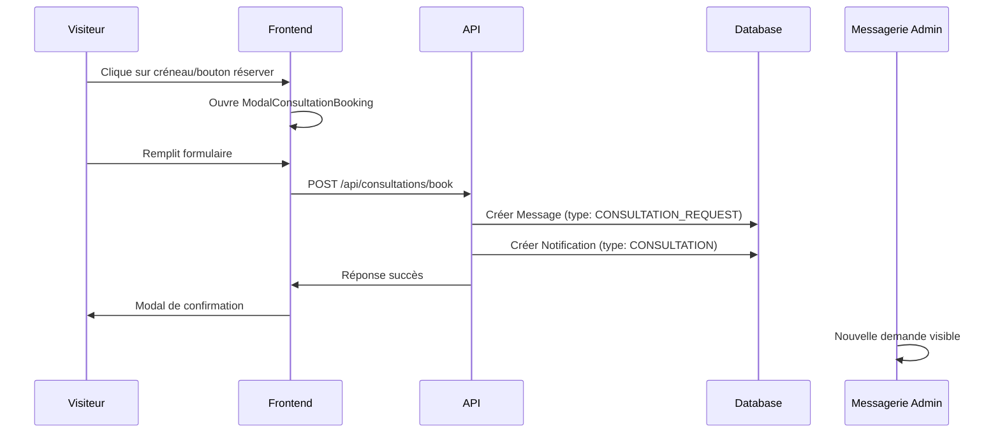
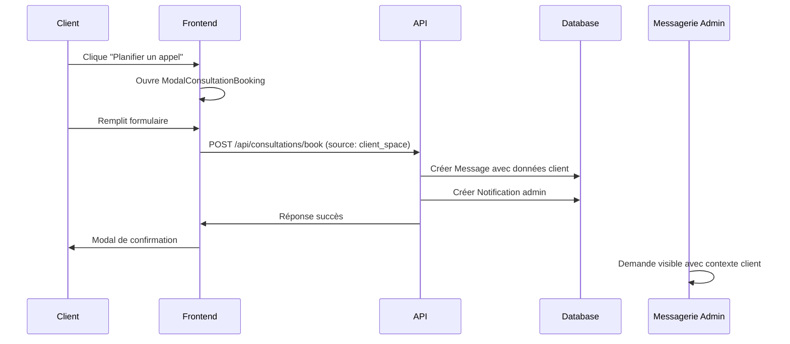

# 📞 Guide du Système de Réservation de Consultations - Staka Livres

## 📋 Vue d'ensemble

Le système de réservation de consultations permet aux visiteurs et clients de planifier facilement des appels téléphoniques gratuits de 30 minutes avec les experts Staka Livres. Cette fonctionnalité ultra-simplifiée intègre la landing page et l'espace client pour une expérience utilisateur optimale.

## 🎯 Fonctionnalités

### ✅ Points d'accès
- **Landing Page** : Section "Réservez votre consultation gratuite"
- **Espace Client** : Bouton "Planifier un appel" dans la page Aide & Support

### ✅ Processus de réservation
1. **Sélection de créneau** (optionnelle sur landing page)
2. **Formulaire simplifié** : nom, prénom, email, téléphone, date, heure, message
3. **Validation instantanée** et envoi à l'équipe support
4. **Modal de confirmation** avec message explicatif
5. **Notification automatique** vers l'admin dans la messagerie

## 🏗️ Architecture Technique

### Frontend Components

#### ModalConsultationBooking.tsx
```typescript
interface ModalConsultationBookingProps {
  isOpen: boolean;
  onClose: () => void;
  selectedSlot?: { day: string; time: string } | null;
}
```

**Fonctionnalités :**
- Formulaire de réservation avec validation
- Sélection dynamique des créneaux (7 jours ouvrés)
- Gestion des états (formulaire, soumission, succès)
- Intégration avec React Query pour les appels API
- Toast notifications pour le feedback utilisateur

#### Hook useConsultation.ts
```typescript
// Réservation de consultation
const useBookConsultation = () => useMutation({
  mutationFn: bookConsultation,
  onError: (error) => console.error('Erreur:', error)
});

// Créneaux disponibles
const useAvailableSlots = () => ({
  getAvailableSlots: (date?: string) => fetch('/api/consultations/available-slots')
});
```

### Backend API

#### Endpoints disponibles

| Méthode | Route | Accès | Description |
|---------|-------|-------|-------------|
| `POST` | `/api/consultations/book` | Public | Réserver une consultation |
| `GET` | `/api/consultations/available-slots` | Public | Créneaux disponibles |
| `GET` | `/api/consultations/requests` | Admin | Liste des demandes |
| `PUT` | `/api/consultations/requests/:id` | Admin | Marquer comme traitée |

#### Schema de validation (Zod)
```typescript
const consultationBookingSchema = z.object({
  firstName: z.string().min(1, 'Le prénom est requis'),
  lastName: z.string().min(1, 'Le nom est requis'),
  email: z.string().email('Email invalide'),
  phone: z.string().optional(),
  date: z.string().min(1, 'La date est requise'),
  time: z.string().min(1, 'L\'heure est requise'),
  message: z.string().optional(),
  requestedDateTime: z.string().min(1, 'Date et heure requises'),
  source: z.enum(['landing_page', 'client_space']).default('landing_page')
});
```

### Base de Données

#### Nouveaux champs Message (Prisma)
```prisma
model Message {
  // ... champs existants
  metadata       Json?         // Données spécifiques consultation
  status         String?       // Statut personnalisé  
  isFromVisitor  Boolean       @default(false)
  type           MessageType   // Nouveau : CONSULTATION_REQUEST
}

enum MessageType {
  USER_MESSAGE
  SYSTEM_MESSAGE
  NOTIFICATION
  SUPPORT_MESSAGE
  ADMIN_MESSAGE
  CONSULTATION_REQUEST  // Nouveau type
}

enum NotificationType {
  // ... types existants
  CONSULTATION  // Nouveau type
}
```

## 🔄 Flux de Données

### 1. Réservation depuis Landing Page


### 2. Réservation depuis Espace Client


## 📊 Format des Données

### Message de Consultation (Database)
```json
{
  "id": "uuid",
  "content": "🗓️ **NOUVELLE DEMANDE DE CONSULTATION**\n\n**Informations du contact :**\n- Nom : John Doe\n- Email : john@example.com\n- Téléphone : 06 12 34 56 78\n\n**Créneaux souhaités :**\n- Date : 2025-07-15\n- Heure : 14:00\n\n**Message :**\nJe souhaite discuter de mon manuscrit de 300 pages\n\n**Source :** Page d'accueil\n\n---\n⚠️ **Action requise :** Veuillez confirmer ce rendez-vous par email à john@example.com",
  "subject": "🗓️ Demande de consultation gratuite",
  "visitorName": "John Doe",
  "visitorEmail": "john@example.com",
  "type": "CONSULTATION_REQUEST",
  "isFromVisitor": true,
  "status": "UNREAD",
  "metadata": {
    "consultationRequest": {
      "firstName": "John",
      "lastName": "Doe",
      "email": "john@example.com",
      "phone": "06 12 34 56 78",
      "requestedDate": "2025-07-15",
      "requestedTime": "14:00",
      "message": "Je souhaite discuter de mon manuscrit de 300 pages",
      "source": "landing_page"
    }
  }
}
```

### Notification Admin
```json
{
  "type": "CONSULTATION",
  "title": "Nouvelle demande de consultation",
  "message": "John Doe souhaite planifier un appel le 2025-07-15 à 14:00",
  "data": "{\"messageId\":\"uuid\",\"email\":\"john@example.com\",\"requestedDateTime\":\"2025-07-15 14:00\"}"
}
```

## 🎨 Interface Utilisateur

### Landing Page - Section Consultation
- **Design** : Section intégrée avec gradient bleu/indigo
- **Créneaux prédéfinis** : 4 boutons avec jours/heures exemples
- **Bouton principal** : "Réserver ce créneau"
- **Animation** : Hover effects et transitions fluides

### Espace Client - Page Aide
- **Bouton** : "Planifier un appel" avec icône téléphone
- **Style** : bg-blue-600 hover:bg-blue-700
- **Placement** : Dans la section "Actions rapides"

### Modal de Réservation
- **Design responsive** : max-w-2xl, scrollable sur mobile
- **Champs requis** : Prénom*, Nom*, Email*, Date*, Heure*
- **Validation temps réel** : Messages d'erreur contextuels
- **États visuels** : Loading, succès, erreur

## 🔧 Configuration et Paramètres

### Créneaux Disponibles
```typescript
// Horaires de consultation (configurable)
const timeSlots = [
  '09:00', '09:30', '10:00', '10:30', '11:00', '11:30',
  '14:00', '14:30', '15:00', '15:30', '16:00', '16:30', '17:00'
];

// Jours disponibles : Lundi à Vendredi (automatique)
const getNextWeekDays = () => {
  // Exclut samedi et dimanche
  // Retourne 7 jours ouvrés suivants
};
```

### Variables d'Environnement
Aucune configuration supplémentaire requise. Le système utilise l'infrastructure existante :
- Base de données MySQL via Prisma
- Authentification JWT pour les routes admin
- API REST standard

## 🧪 Tests et Validation

### Tests Frontend
```bash
# Tester la compilation TypeScript
cd frontend && npm run build

# Vérifier les types
npm run type-check  # Si disponible
```

### Tests Backend
```bash
# Tester la compilation
cd backend && npm run build

# Générer le client Prisma
npm run db:generate

# Migrer la base de données
npm run db:migrate
```

### Tests d'Intégration
1. **Landing Page** :
   - Cliquer sur un créneau prédéfini
   - Remplir le formulaire de réservation
   - Vérifier la modal de confirmation
   - Vérifier la réception dans la messagerie admin

2. **Espace Client** :
   - Cliquer sur "Planifier un appel"
   - Tester le formulaire sans créneau prédéfini
   - Vérifier la source 'client_space' dans les données

3. **Administration** :
   - Vérifier la réception des messages type CONSULTATION_REQUEST
   - Tester les notifications admin
   - Vérifier le format des métadonnées

## 🚀 Déploiement et Migration

### Migration Base de Données
```bash
# Générer et appliquer la migration
cd backend
npm run db:generate
npm run db:migrate

# Vérifier les nouveaux champs
# - Message.metadata (Json)
# - Message.status (String)
# - Message.isFromVisitor (Boolean)
# - MessageType.CONSULTATION_REQUEST
# - NotificationType.CONSULTATION
```

### Tests de Production
1. **Fonctionnalité complète** : Landing page → Formulaire → Confirmation → Admin
2. **Gestion d'erreurs** : Validation côté client et serveur
3. **Performance** : Temps de réponse < 1s pour la réservation
4. **Sécurité** : Validation Zod, rate limiting possible

## 📈 Métriques et Suivi

### Données Analytics Recommandées
- Nombre de demandes de consultation par jour/semaine
- Taux de conversion landing page → réservation
- Créneaux les plus demandés
- Source des demandes (landing vs espace client)
- Temps de traitement par l'équipe support

### Logs et Monitoring
```typescript
// Logs automatiques dans consultationController.ts
console.log(`Nouvelle demande de consultation: ${email} - ${requestedDateTime}`);

// Métriques Prisma disponibles
- Message.type === 'CONSULTATION_REQUEST'
- Notification.type === 'CONSULTATION'
```

## 🔄 Évolutions Futures

### Améliorations Possibles
1. **Calendrier intégré** : Remplacement des créneaux fixes par un vrai calendrier
2. **Confirmation automatique** : Email de confirmation automatique côté système
3. **Rappels** : Notifications 24h avant le rendez-vous
4. **Visioconférence** : Intégration Zoom/Teams pour les appels
5. **Synchronisation calendrier** : Export iCal/Google Calendar

### Intégrations Tierces
- **Calendly** : Remplacement possible de la solution custom
- **SendGrid** : Emails de confirmation automatiques
- **Stripe** : Éventuel système de consultations payantes premium

---

## 📚 Références Techniques

### Fichiers Modifiés/Créés
```
frontend/src/
├── components/modals/ModalConsultationBooking.tsx  # Nouveau
├── hooks/useConsultation.ts                        # Nouveau  
├── components/landing/Services.tsx                 # Modifié
└── pages/HelpPage.tsx                             # Modifié

backend/src/
├── controllers/consultationController.ts          # Nouveau
├── routes/consultations.ts                        # Nouveau
├── app.ts                                         # Modifié
└── prisma/schema.prisma                          # Modifié

docs/
└── CONSULTATION_BOOKING_GUIDE.md                 # Nouveau
```

### Dépendances Utilisées
- **Frontend** : React Query, Framer Motion, Tailwind CSS
- **Backend** : Express, Prisma, Zod, JWT
- **Base** : Aucune nouvelle dépendance ajoutée

---

*Documentation créée le 12 juillet 2025 - Version 1.0.0*