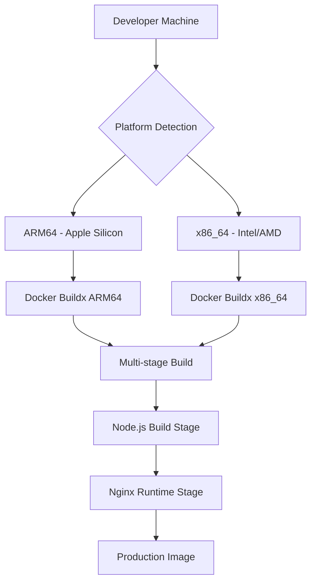

# 🐳 Docker Deployment Guide - Staka Livres

## 📋 Table des Matières

- [Vue d'ensemble](#vue-densemble)
- [Architecture Multi-Platform](#architecture-multi-platform)
- [Démarrage Rapide](#démarrage-rapide)
- [Configuration Docker Compose](#configuration-docker-compose)
- [Build Multi-Architecture](#build-multi-architecture)
- [Configuration de Production](#configuration-de-production)
- [Monitoring et Logs](#monitoring-et-logs)
- [Troubleshooting](#troubleshooting)
- [Sécurité](#sécurité)
- [Performance](#performance)

## 🎯 Vue d'ensemble

Staka Livres utilise une architecture Docker containerisée avec support multi-plateforme (ARM64/x86) pour une compatibilité optimale avec les environnements de développement Apple Silicon et les serveurs de production x86.

### 🏗️ Services Containerisés

| Service           | Port      | Description                | Image Base          |
| ----------------- | --------- | -------------------------- | ------------------- |
| **Frontend**      | 3000 → 80 | React + Vite → Nginx       | `nginx:1.25-alpine` |
| **Backend**       | 3001      | Node.js + Express + Prisma | `node:18-alpine`    |
| **Database**      | 3306      | MySQL 8 avec native auth   | `mysql:8`           |
| **Prisma Studio** | 5555      | Interface base de données  | Intégré au backend  |

### 🔄 Architecture Multi-Platform



## 🚀 Démarrage Rapide

### Prérequis

- **Docker Desktop** 20.10+ avec Buildx activé
- **Docker Compose** v2.0+
- **Git** pour cloner le repository
- **8GB RAM** minimum recommandé

### Installation

```bash
# 1. Cloner le projet
git clone https://github.com/staka/livres.git
cd staka-livres

# 2. Configuration environnement
cp backend/.env.example backend/.env
# Éditer backend/.env avec vos paramètres

# 3. Démarrage rapide
docker compose up -d

# 4. Vérification des services
curl http://localhost:3001/health  # Backend
curl http://localhost:3000/health  # Frontend
```

### Accès aux Services

```bash
# Frontend - Interface utilisateur
open http://localhost:3000

# Backend API - Documentation
open http://localhost:3001

# Prisma Studio - Base de données
open http://localhost:5555

# Logs en temps réel
docker compose logs -f
```

## ⚙️ Configuration Docker Compose

### Structure des Services

```yaml
# docker-compose.yml
services:
  frontend:
    build:
      context: ./frontend
      dockerfile: Dockerfile
    platform: linux/arm64 # Auto-détection si ARM64
    ports:
      - "3000:80"
    environment:
      - VITE_API_URL=http://backend:3001
    depends_on:
      - backend

  backend:
    build:
      context: .
      dockerfile: backend/Dockerfile
    ports:
      - "3001:3001"
      - "5555:5555" # Prisma Studio
    environment:
      - DATABASE_URL=mysql://staka:staka@db:3306/stakalivres
    depends_on:
      - db

  db:
    image: mysql:8
    environment:
      - MYSQL_ROOT_PASSWORD=root
      - MYSQL_DATABASE=stakalivres
      - MYSQL_USER=staka
      - MYSQL_PASSWORD=staka
    ports:
      - "3306:3306"
    volumes:
      - db_data:/var/lib/mysql
```

### Variables d'Environnement

**Backend (.env)**

```bash
# Base de données
DATABASE_URL="mysql://staka:staka@db:3306/stakalivres"
SHADOW_DATABASE_URL="mysql://staka:staka@db:3306/prisma_shadow"

# JWT
JWT_SECRET="your_secure_jwt_secret_min_32_chars"
NODE_ENV="production"

# API URLs
FRONTEND_URL="https://yourdomain.com"
PORT=3001

# Stripe
STRIPE_SECRET_KEY="sk_live_..."
STRIPE_WEBHOOK_SECRET="whsec_..."

# Système d'emails centralisé (NOUVEAU 2025)
SENDGRID_API_KEY="SG...."
FROM_EMAIL="noreply@staka-livres.com"
FROM_NAME="Staka Livres"
ADMIN_EMAIL="admin@staka-livres.fr"
SUPPORT_EMAIL="support@staka-livres.fr"
APP_URL="https://yourdomain.com"

# Services externes (optionnels)
AWS_ACCESS_KEY_ID="AKIA..."
AWS_SECRET_ACCESS_KEY="..."
AWS_REGION="eu-west-3"
AWS_S3_BUCKET="staka-livres-files"
```

**Frontend (injection automatique)**

```bash
VITE_API_URL=http://backend:3001
DOCKER_ENV=true
```

## 🏗️ Build Multi-Architecture

### Script docker-build.sh

Le script `scripts/docker-build.sh` gère automatiquement le build multi-plateforme :

```bash
# Syntaxe générale
./scripts/docker-build.sh [TAG] [OPTIONS]

# Exemples d'utilisation
./scripts/docker-build.sh                    # Build latest local
./scripts/docker-build.sh 1.2.0 --push     # Build et push v1.2.0
./scripts/docker-build.sh dev --target frontend  # Build frontend uniquement
PUSH=true ./scripts/docker-build.sh v1.0.0  # Avec variable env
```

### Options Avancées

```bash
# Build avec plateformes spécifiques
./scripts/docker-build.sh --platform linux/amd64,linux/arm64

# Registry personnalisé
./scripts/docker-build.sh --registry ghcr.io --namespace myorg

# Mode debug
DEBUG=true ./scripts/docker-build.sh latest
```

### Architecture Dockerfile Frontend

```dockerfile
# syntax=docker/dockerfile:1.6
ARG NODE_VERSION=18.20.2

# ---- Stage 1: Dependencies ----
FROM --platform=$BUILDPLATFORM node:${NODE_VERSION}-alpine AS deps
WORKDIR /app
RUN corepack enable
COPY package.json package-lock.json* pnpm-lock.yaml* ./
RUN npm ci --only=production

# ---- Stage 2: Builder ----
FROM --platform=$BUILDPLATFORM node:${NODE_VERSION}-alpine AS builder
WORKDIR /app
COPY --from=deps /app/node_modules ./node_modules
COPY . .
RUN npm ci && npm run build

# ---- Stage 3: Runtime ----
FROM --platform=$TARGETPLATFORM nginx:1.25-alpine AS runtime
COPY --from=builder /app/dist /usr/share/nginx/html
COPY nginx.conf /etc/nginx/conf.d/default.conf
EXPOSE 80
CMD ["nginx", "-g", "daemon off;"]
```

## 🔧 Configuration de Production

### Optimisations Performance

**Frontend - nginx.conf**

```nginx
server {
    listen 80;
    root /usr/share/nginx/html;

    # Compression gzip
    gzip on;
    gzip_types application/javascript text/css application/json;

    # Cache assets statiques
    location ~* \.(js|css|png|jpg|jpeg|gif|ico|svg)$ {
        expires 1y;
        add_header Cache-Control "public, immutable";
    }

    # Proxy API
    location /api {
        proxy_pass http://backend:3001;
        proxy_set_header Host $host;
        proxy_set_header X-Real-IP $remote_addr;
    }

    # SPA fallback
    location / {
        try_files $uri $uri/ /index.html;
    }
}
```

**Backend - Configuration**

```typescript
// src/app.ts
app.use(
  helmet({
    crossOriginEmbedderPolicy: false,
    contentSecurityPolicy: {
      directives: {
        defaultSrc: ["'self'"],
        styleSrc: ["'self'", "'unsafe-inline'"],
        scriptSrc: ["'self'"],
        imgSrc: ["'self'", "data:", "https:"],
      },
    },
  })
);

app.use(express.json({ limit: "50mb" }));
app.use(express.urlencoded({ extended: true, limit: "50mb" }));
```

### 📧 Configuration Système d'Emails Centralisé

**Initialisation EventBus et Listeners**

```typescript
// src/app.ts - Chargement automatique des listeners
import "./listeners/adminNotificationEmailListener";
import "./listeners/userNotificationEmailListener";

// src/events/eventBus.ts - EventBus global
import { EventEmitter } from "events";
export const eventBus = new EventEmitter();
eventBus.setMaxListeners(50); // Augmenter pour production
```

**Configuration Queue Emails (Optionnel)**

```yaml
# docker-compose.prod.yml - Service Redis pour queue emails
services:
  redis:
    image: redis:7-alpine
    restart: unless-stopped
    ports:
      - "6379:6379"
    volumes:
      - redis_data:/data
    command: redis-server --appendonly yes

  backend:
    environment:
      - REDIS_URL=redis://redis:6379
    depends_on:
      - db
      - redis

volumes:
  redis_data:
```

### Surveillance des Ressources

```bash
# Monitoring ressources containers
docker stats

# Logs détaillés par service
docker compose logs backend --tail 100 -f
docker compose logs frontend --tail 100 -f
docker compose logs db --tail 100 -f

# Inspection des images
docker images ls
docker inspect staka-livres-frontend:latest
```

### Backup Base de Données

```bash
# Backup automatisé
docker exec staka_db mysqldump -u root -proot stakalivres > backup-$(date +%Y%m%d).sql

# Restauration
docker exec -i staka_db mysql -u root -proot stakalivres < backup-20250112.sql
```

## 📊 Monitoring et Logs

### Logs Structurés

**Backend Logging**

```typescript
// Backend utilise Winston pour logs structurés
import winston from "winston";

const logger = winston.createLogger({
  level: "info",
  format: winston.format.combine(
    winston.format.timestamp(),
    winston.format.errors({ stack: true }),
    winston.format.json()
  ),
  transports: [
    new winston.transports.File({ filename: "logs/error.log", level: "error" }),
    new winston.transports.File({ filename: "logs/combined.log" }),
    new winston.transports.Console({
      format: winston.format.simple(),
    }),
  ],
});
```

**Collecte des Logs**

```bash
# Logs en temps réel avec filtres
docker compose logs -f backend | grep ERROR
docker compose logs -f frontend | grep nginx

# Logs système d'emails centralisé
docker compose logs -f backend | grep "\[EventBus\]"
docker compose logs -f backend | grep "\[EmailQueue\]"
docker compose logs -f backend | grep "\[EmailListener\]"

# Export logs pour analyse
docker compose logs --no-color > staka-logs-$(date +%Y%m%d).log
```

**Monitoring Emails Spécifique**

```bash
# Vérification EventBus en temps réel
docker compose exec backend node -e "
  const { eventBus } = require('./dist/events/eventBus');
  console.log('EventBus listeners:', eventBus.eventNames());
  console.log('Max listeners:', eventBus.getMaxListeners());
"

# Vérification templates emails
docker compose exec backend ls -la src/emails/templates/

# Test envoi email (dev)
docker compose exec backend node -e "
  const { MailerService } = require('./dist/services/MailerService');
  MailerService.sendEmail({
    to: 'test@example.com',
    subject: 'Test Docker',
    html: '<h1>Test email système</h1>'
  }).then(() => console.log('✅ Email envoyé'))
    .catch(err => console.error('❌ Erreur:', err));
"
```

### Métriques de Performance

```bash
# Stats containers en temps réel
docker stats --format "table {{.Container}}\t{{.CPUPerc}}\t{{.MemUsage}}\t{{.NetIO}}"

# Inspection ressources
docker system df
docker system events --filter container=staka_backend
```

## 🐛 Troubleshooting

### Problèmes Fréquents

#### 1. Erreur Module Rollup ARM64

**Symptôme :**

```
Error: Cannot find module @rollup/rollup-linux-arm64-gnu
```

**Solutions :**

```bash
# Solution 1: Force rebuild dependencies
docker compose down
docker compose build --no-cache frontend

# Solution 2: Platform override
docker --platform linux/amd64 compose up frontend

# Solution 3: Clear cache complet
docker system prune -a
docker volume prune
```

#### 2. Frontend Ne Démarre Pas

**Symptôme :**

```
frontend | npm ERR! Cannot find module 'esbuild'
```

**Solutions :**

```bash
# Nettoyer node_modules dans container
docker compose exec frontend rm -rf node_modules
docker compose exec frontend npm install

# Rebuild avec cache vide
docker compose build --no-cache frontend

# Vérifier permissions
docker compose exec frontend ls -la node_modules/.bin/
```

#### 3. Base de Données Connection Refused

**Symptôme :**

```
Error: connect ECONNREFUSED 127.0.0.1:3306
```

**Solutions :**

```bash
# Vérifier statut MySQL
docker compose logs db

# Attendre MySQL ready
docker compose up db
# Attendre "ready for connections" puis démarrer backend

# Reset volume MySQL si corruption
docker compose down -v
docker compose up db
```

#### 4. Port Déjà Utilisé

**Symptôme :**

```
Error: listen EADDRINUSE: address already in use :::3001
```

**Solutions :**

```bash
# Identifier processus utilisant le port
lsof -i :3001
lsof -i :3000

# Killer processus spécifique
kill -9 $(lsof -t -i:3001)

# Alternative: changer ports dans docker-compose.yml
ports:
  - "3002:3001"  # Backend sur port 3002
  - "3001:80"    # Frontend sur port 3001
```

### Outils de Débogage

#### Container Shell Access

```bash
# Accès shell backend
docker compose exec backend sh

# Accès shell frontend (Nginx)
docker compose exec frontend sh

# Accès MySQL
docker compose exec db mysql -u root -proot stakalivres
```

#### Debug Build Process

```bash
# Build avec logs verbeux
DOCKER_BUILDKIT=1 docker compose build --progress=plain frontend

# Debug buildx multi-platform
docker buildx build --platform linux/amd64,linux/arm64 \
  --progress=plain \
  -f frontend/Dockerfile \
  ./frontend
```

#### Validation Configuration

```bash
# Valider docker-compose.yml
docker compose config

# Test connexions réseau
docker compose exec backend ping db
docker compose exec frontend ping backend

# Vérifier variables environnement
docker compose exec backend env | grep DATABASE
docker compose exec frontend env | grep VITE
```

### Problèmes de Rosetta (macOS)

**Sur Apple Silicon, si problèmes persistants :**

```bash
# Activer Rosetta dans Docker Desktop
# Settings > General > Use Rosetta for x86/amd64 emulation

# Force platform x86 pour tous services
export DOCKER_DEFAULT_PLATFORM=linux/amd64
docker compose up

# Ou par service
docker --platform linux/amd64 compose up frontend
```

#### 5. Emails Ne S'Envoient Pas (NOUVEAU 2025)

**Symptôme :**

```
[EmailQueue] ❌ Erreur envoi email: Invalid API key
[EventBus] ⚠️ Listener adminNotificationEmailListener failed
```

**Solutions :**

```bash
# Vérifier configuration SendGrid
docker compose exec backend env | grep SENDGRID
docker compose exec backend env | grep FROM_EMAIL
docker compose exec backend env | grep ADMIN_EMAIL

# Tester configuration email
docker compose exec backend node -e "
  console.log('SENDGRID_API_KEY:', !!process.env.SENDGRID_API_KEY);
  console.log('FROM_EMAIL:', process.env.FROM_EMAIL);
  console.log('ADMIN_EMAIL:', process.env.ADMIN_EMAIL);
"

# Vérifier EventBus listeners
docker compose exec backend node -e "
  const { eventBus } = require('./dist/events/eventBus');
  console.log('Event listeners:', eventBus.eventNames());
"

# Tester émission événement
docker compose exec backend node -e "
  const { eventBus } = require('./dist/events/eventBus');
  eventBus.emit('admin.notification.created', {
    title: 'Test Docker',
    message: 'Test depuis container',
    type: 'INFO'
  });
  console.log('✅ Événement émis');
"

# Vérifier templates disponibles
docker compose exec backend find src/emails/templates/ -name "*.hbs" -type f
```

### Logs de Debug

```bash
# Activer debug mode
export DEBUG=*
docker compose up

# Debug spécifique buildx
export BUILDX_EXPERIMENTAL=1
export DOCKER_BUILDKIT_PROGRESS=plain
```

## 🔒 Sécurité

### Sécurisation Production

**1. Variables d'Environnement**

```bash
# Utiliser Docker secrets en production
echo "super_secret_jwt_key" | docker secret create jwt_secret -
echo "stripe_live_key" | docker secret create stripe_key -
```

**2. Non-Root User**

```dockerfile
# Dans Dockerfile
RUN addgroup -g 1001 -S nodejs
RUN adduser -S nextjs -u 1001
USER nextjs
```

**3. Network Isolation**

```yaml
# docker-compose.prod.yml
networks:
  frontend:
  backend:

services:
  frontend:
    networks:
      - frontend
  backend:
    networks:
      - frontend
      - backend
  db:
    networks:
      - backend
```

### Audit Sécurité

```bash
# Scan vulnerabilités images
docker scout cves staka-livres-frontend:latest
docker scout cves staka-livres-backend:latest

# Analyse Dockerfile
hadolint frontend/Dockerfile
hadolint backend/Dockerfile
```

## ⚡ Performance

### Optimisations Build

**Multi-stage Build Benefits:**

- **Taille image réduite** : ~90% moins volumineux (3GB → 300MB)
- **Sécurité améliorée** : Pas de sources ni build tools en production
- **Cache intelligent** : Layers optimisés pour CI/CD

**Cache Strategies:**

```bash
# Build avec cache registry
docker buildx build \
  --cache-from type=registry,ref=ghcr.io/staka/cache \
  --cache-to type=registry,ref=ghcr.io/staka/cache,mode=max
```

### Production Checklist

- [ ] Variables d'environnement sécurisées
- [ ] HTTPS configuré (reverse proxy)
- [ ] Base de données avec backup automatique
- [ ] Logs centralisés
- [ ] Monitoring ressources
- [ ] Health checks configurés
- [ ] Restart policies définies
- [ ] Secrets Docker utilisés
- [ ] Network isolation activée
- [ ] Images scannées pour vulnérabilités

#### 📧 Checklist Système d'Emails Centralisé

- [ ] **SendGrid configuré** : API key valide et domaine vérifié
- [ ] **Variables email** : FROM_EMAIL, ADMIN_EMAIL, SUPPORT_EMAIL définies
- [ ] **Templates présents** : 18 fichiers .hbs dans src/emails/templates/
- [ ] **EventBus actif** : Listeners chargés automatiquement au démarrage
- [ ] **Queue fonctionnelle** : Redis configuré si mode queue asynchrone
- [ ] **Tests envoi** : Email test envoyé et reçu avec succès
- [ ] **Monitoring emails** : Logs EventBus/EmailQueue surveillés
- [ ] **Gestion d'erreurs** : Retry automatique et fallback configurés
- [ ] **Performance** : Queue asynchrone pour éviter blocage API
- [ ] **Opt-out utilisateur** : Préférences email respectées

---

## 📚 Ressources Additionnelles

- [Docker Best Practices](https://docs.docker.com/develop/dev-best-practices/)
- [Multi-stage Builds](https://docs.docker.com/develop/multistage-build/)
- [Docker Buildx](https://docs.docker.com/buildx/working-with-buildx/)
- [Docker Compose Production](https://docs.docker.com/compose/production/)

---

_Documentation mise à jour le 12 juillet 2025 - Version 2.0.0_
