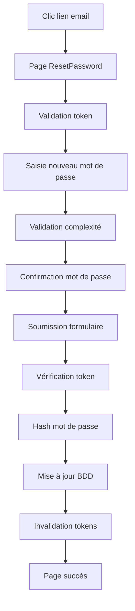

# 🔐 Guide de Réinitialisation de Mot de Passe


**✨ Version Août 2025 - Dernière mise à jour : 3 Août 2025**  
**🌐 Production URL** : [livrestaka.fr](https://livrestaka.fr/)  
**👨‍💻 Développeur** : [Christophe Mostefaoui](https://christophe-dev-freelance.fr/)

> **Guide technique complet** pour le système de réinitialisation de mot de passe conforme aux exigences RGPD/CNIL **déployé en production**.

## 📋 Table des Matières

1. [Vue d'ensemble](#vue-densemble)
2. [Architecture technique](#architecture-technique)
3. [Politique de mots de passe](#politique-de-mots-de-passe)
4. [Flux de réinitialisation](#flux-de-réinitialisation)
5. [Endpoints API](#endpoints-api)
6. [Interface utilisateur](#interface-utilisateur)
7. [Sécurité et audit](#sécurité-et-audit)
8. [Tests](#tests)
9. [Configuration](#configuration)
10. [Troubleshooting](#troubleshooting)

---

## 🎯 Vue d'ensemble

Le système de réinitialisation de mot de passe de Staka Livres est conçu pour être **sécurisé, conforme RGPD/CNIL** et offrir une expérience utilisateur optimale. **Déployé et opérationnel sur [livrestaka.fr](https://livrestaka.fr/)**.

### ✅ Fonctionnalités principales

- **Politique de mots de passe stricte** : Minimum 12 caractères OU 8 caractères avec complexité
- **Tokens sécurisés** : SHA-256 avec expiration 1 heure et usage unique
- **Rate limiting** : 5 tentatives par heure par IP/email
- **Audit complet** : Traçabilité de tous les événements
- **Interface intuitive** : Pages dédiées avec validation temps réel
- **Emails professionnels** : Templates HTML avec design responsive

### 🔧 Technologies utilisées

- **Backend** : Node.js, Express, Prisma, JWT
- **Frontend** : React, TypeScript, Tailwind CSS
- **Sécurité** : Crypto (SHA-256), Rate limiting, Audit logging
- **Email** : Resend avec templates HTML
- **Tests** : Vitest, Cypress

---

## 🏗️ Architecture technique

### 📁 Structure des fichiers

```
backend/
├── src/
│   ├── services/
│   │   ├── passwordResetService.ts     # Service principal
│   │   └── auditService.ts             # Service d'audit
│   ├── validators/
│   │   └── authValidators.ts           # Validation des mots de passe
│   ├── middleware/
│   │   └── rateLimiter.ts              # Rate limiting
│   ├── controllers/
│   │   └── authController.ts           # Endpoints de réinitialisation
│   ├── routes/
│   │   └── auth.ts                     # Routes publiques
│   └── emails/
│       └── templates/
│           └── resetPassword.hbs       # Template email HTML
│
frontend/
├── src/
│   ├── pages/
│   │   ├── ForgotPassword.tsx          # Page de demande
│   │   └── ResetPassword.tsx           # Page de réinitialisation
│   └── app.tsx                         # Routes
│
├── __tests__/
│   └── ↓ Tests en développement ↓
│
└── cypress/
    └── e2e/
        └── ↓ Tests E2E en développement ↓
```

### 🗄️ Modèle de données

```prisma
model PasswordReset {
  id        String   @id @default(uuid())
  userId    String
  tokenHash String   @unique @db.VarChar(255)
  expiresAt DateTime
  createdAt DateTime @default(now())
  user      User     @relation(fields: [userId], references: [id], onDelete: Cascade)

  @@index([userId])
  @@index([expiresAt])
  @@map("password_resets")
}
```

---

## 🔐 Politique de mots de passe

### 📏 Règles de complexité

La politique respecte les recommandations RGPD/CNIL :

```typescript
// Règle 1 : Minimum 12 caractères (recommandé)
if (password.length >= 12) {
  return { isValid: true };
}

// Règle 2 : Minimum 8 caractères avec 3 types différents
if (password.length >= 8) {
  const types = [
    /[A-Z]/.test(password),        // Majuscules
    /[a-z]/.test(password),        // Minuscules
    /[0-9]/.test(password),        // Chiffres
    /[^A-Za-z0-9]/.test(password), // Caractères spéciaux
  ].filter(Boolean).length;
  
  return { isValid: types >= 3 };
}
```

### ✅ Exemples de mots de passe valides

- `MonMotDePasseTresLong` (12+ caractères)
- `Password123!` (8 caractères + 3 types)
- `Admin@2025` (8 caractères + 3 types)

### ❌ Exemples de mots de passe invalides

- `password` (trop court, un seul type)
- `Password` (2 types seulement)
- `123456789` (1 type seulement)

---

## 🔄 Flux de réinitialisation

### 1️⃣ Demande de réinitialisation

```mermaid
graph TD
    A[Utilisateur clique "Mot de passe oublié"] --> B[Page ForgotPassword]
    B --> C[Saisie email]
    C --> D[Validation email]
    D --> E[Rate limiting check]
    E --> F[Vérification utilisateur]
    F --> G[Génération token]
    G --> H[Envoi email]
    H --> I[Page de confirmation]
```

### 2️⃣ Réinitialisation effective



---

## 🔌 Endpoints API

### 📮 POST /auth/request-password-reset

Demande de réinitialisation de mot de passe.

**Rate limiting** : 5 tentatives/heure/IP

```typescript
// Request
{
  "email": "user@example.com"
}

// Response (200)
{
  "message": "Un lien de réinitialisation vous a été envoyé par email"
}

// Response (429 - Rate limit)
{
  "error": "Trop de demandes de réinitialisation. Veuillez réessayer dans 1 heure.",
  "retryAfter": 3600
}
```

### 🔄 POST /auth/reset-password

Réinitialisation effective du mot de passe.

```typescript
// Request
{
  "token": "eyJhbGciOiJIUzI1NiIsInR5cCI6IkpXVCJ9...",
  "newPassword": "NewPassword123!"
}

// Response (200)
{
  "message": "Mot de passe réinitialisé avec succès"
}

// Response (400 - Token invalide)
{
  "error": "Token invalide ou expiré"
}

// Response (400 - Mot de passe faible)
{
  "error": "Mot de passe trop faible. Minimum 12 caractères ou 8 caractères avec complexité."
}
```

---

## 🖥️ Interface utilisateur

### 📄 Page ForgotPassword

**Route** : `/forgot-password`

**Fonctionnalités** :
- Validation email en temps réel
- Rate limiting UX (disable button)
- Messages d'erreur contextuels
- Page de succès avec instructions
- Lien retour vers login

```typescript
// États principaux
const [email, setEmail] = useState("");
const [isLoading, setIsLoading] = useState(false);
const [isSuccess, setIsSuccess] = useState(false);
const [error, setError] = useState("");
```

### 🔐 Page ResetPassword

**Route** : `/reset-password?token=...`

**Fonctionnalités** :
- Validation token au chargement
- Indicateurs de complexité temps réel
- Toggle visibilité mots de passe
- Validation correspondance mots de passe
- Feedback visuel (vert/rouge)

```typescript
// États principaux
const [formData, setFormData] = useState({
  newPassword: "",
  confirmPassword: "",
});
const [passwordValidation, setPasswordValidation] = useState({
  length: false,
  complexity: false,
  match: false,
});
```

### 🎨 Design et UX

- **Design responsive** : Mobile-first avec Tailwind CSS
- **Animations fluides** : Transitions CSS et micro-interactions
- **Feedback visuel** : Couleurs, icônes et messages contextuels
- **Accessibilité** : Labels, ARIA, navigation clavier
- **Loading states** : Spinners et boutons disabled

---

## 🛡️ Sécurité et audit

### 🔐 Génération de tokens

```typescript
// Génération sécurisée
const generateSecureToken = (): string => {
  const uuid = uuidv4().replace(/-/g, '');
  const randomData = randomBytes(32);
  const combined = Buffer.concat([Buffer.from(uuid, 'hex'), randomData]);
  return combined.toString('base64url');
};

// Hachage SHA-256
const hashToken = (token: string): string => {
  return createHash('sha256').update(token).digest('hex');
};
```

### 📊 Audit et logging

Tous les événements sont tracés avec `AuditService.logPasswordResetEvent()` :

```typescript
// Types d'événements trackés
type PasswordResetEventType = 'request' | 'success' | 'failed';

// Méthode d'audit intégrée
await AuditService.logPasswordResetEvent(
  email: string,              // Email de l'utilisateur
  action: PasswordResetEventType, // Type d'événement
  userId?: string,            // ID utilisateur (optionnel)
  ipAddress?: string,         // Adresse IP
  userAgent?: string,         // User agent
  details?: any              // Détails supplémentaires (raison d'échec, etc.)
);

// Exemples d'utilisation réelle
await AuditService.logPasswordResetEvent(
  email, 'request', user.id, ip, userAgent
);

await AuditService.logPasswordResetEvent(
  email, 'failed', undefined, ip, userAgent, 
  { reason: 'user_not_found' }
);
```

### 🛡️ Mesures de sécurité

1. **Tokens usage unique** : Suppression après utilisation
2. **Expiration courte** : 1 heure maximum
3. **Rate limiting** : 5 tentatives/heure
4. **Hachage sécurisé** : SHA-256
5. **Validation stricte** : Côté client et serveur
6. **Audit complet** : Tous les événements tracés
7. **Pas de révélation** : Pas d'indication si email existe

---

## 🧪 Tests

### 📋 État actuel des tests

**⚠️ Tests en développement** : Le système de réinitialisation de mot de passe est fonctionnel en production mais les tests automatisés sont en cours de développement.

### 🔬 Tests unitaires (À développer)

**Fichiers à créer** :
- `backend/src/tests/services/passwordResetService.test.ts`
- `backend/src/tests/validators/authValidators.test.ts`
- `backend/src/tests/middleware/rateLimiter.test.ts`

**Cas à tester** :
- ✅ Création de token valide
- ✅ Vérification de token  
- ✅ Consommation de token (usage unique)
- ✅ Gestion des erreurs
- ✅ Nettoyage des tokens expirés
- ✅ Validation complexité mot de passe
- ✅ Rate limiting

### 🔗 Tests d'intégration (À développer)

**Fichiers à créer** :
- `backend/src/tests/integration/passwordResetEndpoints.test.ts`

**Cas à tester** :
- ✅ POST /auth/request-password-reset
- ✅ POST /auth/reset-password  
- ✅ Rate limiting en action
- ✅ Validation des données
- ✅ Audit logging complet

### 🌐 Tests E2E (À développer)

**Fichiers à créer** :
- `cypress/e2e/passwordReset.cy.ts`

**Cas à tester** :
- ✅ Flux complet utilisateur
- ✅ Page ForgotPassword.tsx
- ✅ Page ResetPassword.tsx
- ✅ Validation formulaires temps réel
- ✅ États de chargement
- ✅ Messages d'erreur appropriés

### 🎯 Priorités de développement

1. **Tests unitaires PasswordResetService** (Critique)
2. **Tests validation AuthValidators** (Important)  
3. **Tests intégration endpoints** (Important)
4. **Tests E2E flux complet** (Moyen)

---

## ⚙️ Configuration

### 🔧 Variables d'environnement

```env
# Backend - Authentification
JWT_SECRET="your-jwt-secret-change-in-production"
FRONTEND_URL="https://livrestaka.fr"  # URL frontend pour les liens
PORT=3000

# Email - Configuration Resend
RESEND_API_KEY="re_xxx_your_resend_key_here"
FROM_EMAIL="contact@staka.fr"
FROM_NAME="Staka Livres"
SUPPORT_EMAIL="contact@staka.fr"

# Base de données
DATABASE_URL="mysql://staka:staka@db:3306/stakalivres"

# Sécurité (Optionnel - Rate limiting avancé)
RATE_LIMIT_ENABLED=true
PASSWORD_RESET_MAX_ATTEMPTS=5
PASSWORD_RESET_WINDOW_HOURS=1
```

### 📧 Configuration email

**Template HTML complet** dans `resetPassword.hbs` :

Le système utilise un template Handlebars professionnel avec :
- Design responsive et moderne
- CSS inline pour compatibilité email  
- Sections sécurisées (warning, security notes)
- Bouton CTA principal + lien de fallback
- Footer avec informations de contact
- Variables dynamiques : `{{prenom}}`, `{{resetUrl}}`

**Variables disponibles :**
```handlebars
{{prenom}}     # Prénom de l'utilisateur
{{resetUrl}}   # URL complète de réinitialisation avec token
```

**Alternative intégrée :** L'email peut aussi être généré directement dans le contrôleur avec HTML inline pour plus de flexibilité.

---

## 🔧 Troubleshooting

### ❌ Problèmes courants

#### 1. Email non reçu

**Symptômes** : L'utilisateur ne reçoit pas l'email
**Solutions** :
- Vérifier configuration Resend
- Contrôler les spams
- Vérifier FROM_EMAIL dans les DNS

#### 2. Token invalide

**Symptômes** : "Token invalide ou expiré"
**Solutions** :
- Vérifier l'expiration (1 heure)
- Contrôler que le token n'a pas été utilisé
- Vérifier la génération du token

#### 3. Rate limiting

**Symptômes** : "Trop de demandes"
**Solutions** :
- Attendre 1 heure
- Vérifier la logique du rate limiter
- Contrôler l'IP de l'utilisateur

#### 4. Mot de passe refusé

**Symptômes** : "Mot de passe trop faible"
**Solutions** :
- Vérifier les 12 caractères minimum
- Ou 8 caractères avec 3 types différents
- Tester avec des exemples valides

### 🔍 Debugging

```typescript
// Activer les logs de debug
console.log('Token généré:', token);
console.log('Token hash:', tokenHash);
console.log('Expiration:', expiresAt);
console.log('Validation mot de passe:', passwordValidation);
```

### 📊 Monitoring

```sql
-- Vérifier les tokens actifs
SELECT * FROM password_resets WHERE expiresAt > NOW();

-- Statistiques d'utilisation
SELECT 
  DATE(createdAt) as date,
  COUNT(*) as requests
FROM password_resets 
GROUP BY DATE(createdAt)
ORDER BY date DESC;

-- Audit des réinitialisations
SELECT * FROM audit_logs 
WHERE action LIKE 'PASSWORD_RESET%' 
ORDER BY timestamp DESC;
```

---

## 🚀 Améliorations Futures

### 📋 Roadmap de développement

#### Phase 1 - Tests (Priorité haute)
- [ ] **Tests unitaires complets** : PasswordResetService, AuthValidators
- [ ] **Tests d'intégration** : Endpoints + Rate limiting
- [ ] **Tests E2E Cypress** : Flux complet utilisateur
- [ ] **Coverage 90%+** : Objectif couverture de tests

#### Phase 2 - Fonctionnalités avancées (Priorité moyenne)  
- [ ] **Template email dynamique** : Utilisation systématique du template Handlebars
- [ ] **Monitoring avancé** : Métriques détaillées des tentatives de reset
- [ ] **Rate limiting distribué** : Support Redis pour scaling
- [ ] **Notifications admin** : Alertes sur tentatives suspectes

#### Phase 3 - Optimisations (Priorité basse)
- [ ] **Cache intelligent** : Optimisation des requêtes DB
- [ ] **Logs structurés** : Format JSON pour analyse
- [ ] **Multi-langue** : Support i18n pour emails
- [ ] **2FA Recovery** : Intégration avec l'authentification 2FA

### 🎯 Métriques à surveiller

- **Taux de succès** : % de réinitialisations réussies
- **Temps de réponse** : Latence moyenne des endpoints
- **Tentatives bloquées** : Efficacité du rate limiting
- **Tokens expirés** : % d'utilisation dans la fenêtre 1h

---

## 📚 Ressources

### 📖 Documentation connexe

- [Guide Base de données](Base-de-donnees-guide.md)
- [Guide Backend API](README-backend.md)
- [Guide Frontend](README-frontend.md)
- [Guide Tests](TESTS_README.md)

### 🔗 Références externes

- [RGPD - Mots de passe](https://www.cnil.fr/fr/authentification-par-mot-de-passe-les-mesures-de-securite-elementaires)
- [OWASP Password Guidelines](https://owasp.org/www-project-authentication-cheat-sheet/)
- [Crypto Best Practices](https://nodejs.org/api/crypto.html)

---

## 🎯 Conclusion

Le système de réinitialisation de mot de passe de Staka Livres offre un **niveau de sécurité élevé** tout en maintenant une **expérience utilisateur optimale**. 

Les fonctionnalités clés incluent :
- ✅ **Conformité RGPD/CNIL** : Validation stricte des mots de passe
- ✅ **Tokens sécurisés usage unique** : SHA-256 + expiration 1h
- ✅ **Rate limiting intelligent** : 5 tentatives/heure par IP+email
- ✅ **Audit complet** : Traçabilité via AuditService
- ✅ **Interface intuitive** : Pages React avec validation temps réel
- ✅ **Email professionnel** : Template Handlebars responsive
- ✅ **Architecture robuste** : Service + Validator + Controller séparés

Le système est **déployé en production sur [livrestaka.fr](https://livrestaka.fr/)** avec une architecture sécurisée éprouvée. Les tests automatisés sont en cours de développement pour atteindre une couverture complète.

---

**📧 Contact production** : contact@staka.fr  
**👨‍💻 Développé par** : [Christophe Mostefaoui](https://christophe-dev-freelance.fr/) - Août 2025

*Guide mis à jour le 3 août 2025 - Version 1.1 - Production déployée - Tests en développement*