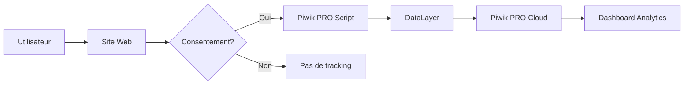
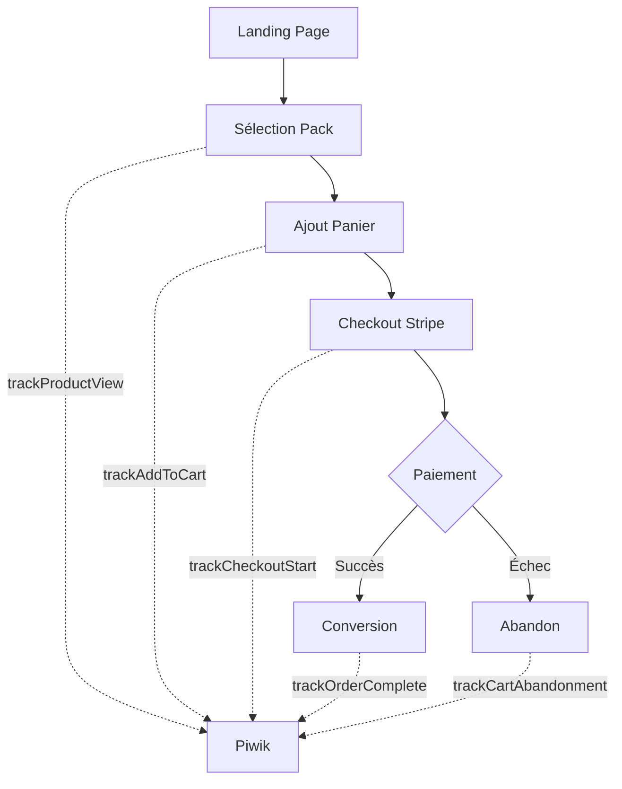

# 📊 Guide Piwik PRO Analytics - Staka Livres

> **Date de mise en place** : 05 Septembre 2025  
> **Version** : 1.0.0  
> **Statut** : ✅ Production

## 📋 Table des matières

1. [Vue d'ensemble](#vue-densemble)
2. [Architecture technique](#architecture-technique)
3. [Composants créés](#composants-créés)
4. [Fonctionnalités de tracking](#fonctionnalités-de-tracking)
5. [Gestion du consentement RGPD](#gestion-du-consentement-rgpd)
6. [Tracking e-commerce](#tracking-e-commerce)
7. [Tracking des campagnes marketing](#tracking-des-campagnes-marketing)
8. [Configuration et personnalisation](#configuration-et-personnalisation)
9. [Guide d'utilisation](#guide-dutilisation)
10. [Maintenance et évolution](#maintenance-et-évolution)

---

## 🎯 Vue d'ensemble

Piwik PRO est une solution d'analytics européenne **100% RGPD-compliant** intégrée à Staka Livres pour mesurer les performances du site et le ROI des campagnes publicitaires (Google Ads, Instagram).

### Pourquoi Piwik PRO ?

- ✅ **RGPD natif** : Hébergement européen, gestion du consentement intégrée
- ✅ **Analytics avancé** : Mesure précise des conversions et du comportement utilisateur
- ✅ **E-commerce tracking** : Suivi complet du tunnel de vente
- ✅ **Attribution marketing** : ROI par canal d'acquisition
- ✅ **Tag Manager intégré** : Gestion centralisée des tags marketing

### Informations de configuration

```javascript
Container ID: a6698d95-0435-4197-a9d4-c5d2e9f0af08
Container URL: https://staka.containers.piwik.pro/
```

---

## 🏗️ Architecture technique

### Structure des fichiers

```
frontend/
├── src/
│   ├── utils/
│   │   └── piwikPro.ts                 # Core tracking library
│   ├── components/
│   │   └── analytics/
│   │       ├── PiwikProProvider.tsx    # React Context Provider
│   │       └── CookieConsentBanner.tsx # Bannière RGPD
│   ├── hooks/
│   │   └── usePiwikTracking.ts         # Hooks de tracking
│   └── App.tsx                          # Intégration principale
└── index.html                           # Script Piwik PRO
```

### Flux de données



---

## 🧩 Composants créés

### 1. `piwikPro.ts` - Core Tracking Library

**Classe principale** : `PiwikProTracker`

**Méthodes disponibles** :

- `init()` : Initialisation du tracking
- `setConsentTypes()` : Gestion du consentement
- `trackEvent()` : Événements personnalisés
- `trackPageView()` : Vues de pages
- `trackConversion()` : Conversions marketing
- `trackEcommercePurchase()` : Achats e-commerce
- `trackSiteSearch()` : Recherches internes
- `setUserId()` : Identification utilisateur
- `setCustomDimensions()` : Dimensions personnalisées

**Exemple d'utilisation** :

```typescript
import { piwikPro } from "@/utils/piwikPro";

// Initialisation
piwikPro.init();

// Track un événement
piwikPro.trackEvent({
  category: "Video",
  action: "Play",
  name: "Introduction",
  value: 30,
});

// Track une conversion
piwikPro.trackConversion("Newsletter Signup", 10, "EUR");
```

### 2. `PiwikProProvider.tsx` - React Context

**Fonctionnalités** :

- Context React pour accès global au tracking
- Tracking automatique des changements de page
- Identification automatique des utilisateurs connectés
- Gestion centralisée du consentement

**Intégration** :

```tsx
// Dans App.tsx
<PiwikProProvider>
  <CookieConsentBanner />
  <AppRoutes />
</PiwikProProvider>
```

**Tracking automatique activé pour** :

- Pages vues avec titre et path
- Identification utilisateur (ID, rôle, email)
- Sections du dashboard
- Pages d'administration
- Processus de paiement

### 3. `CookieConsentBanner.tsx` - Bannière RGPD

**Design** :

- Interface moderne avec icônes
- Mode simple/détaillé avec toggle
- Boutons : Accepter tout / Refuser tout / Personnaliser
- Persistance du choix (30 jours)

**Types de cookies gérés** :
| Type | Description | Défaut |
|------|-------------|--------|
| **Essentiels** | Authentification, sécurité | ✅ Toujours actif |
| **Analytics** | Analyse du trafic et comportement | ✅ Recommandé |
| **Conversion** | Mesure des campagnes publicitaires | ✅ Recommandé |
| **Marketing** | Publicités personnalisées | ❌ Désactivé |
| **Remarketing** | Retargeting publicitaire | ❌ Désactivé |
| **Préférences** | Mémorisation des choix utilisateur | ✅ Recommandé |

### 4. `usePiwikTracking.ts` - Hooks React

**Hooks disponibles** :

#### `usePiwikTracking()` - Hook principal

```typescript
const {
  trackUserInteraction,
  trackButtonClick,
  trackFormSubmit,
  trackError,
  trackFileDownload,
  trackFileUpload,
  trackSearch,
  trackEngagement,
  trackSocialShare,
} = usePiwikTracking();
```

#### `useEcommerceTracking()` - E-commerce

```typescript
const {
  trackOrderComplete,
  trackAddToCart,
  trackProductView,
  trackCheckoutStart,
  trackCartAbandonment,
} = useEcommerceTracking();
```

#### `useMarketingTracking()` - Campagnes

```typescript
const { trackCampaignConversion, trackAdClick, trackLandingPageView } =
  useMarketingTracking();
```

#### `usePerformanceTracking()` - Performance

```typescript
const { trackPageLoadTime, trackPerformanceIssue } = usePerformanceTracking();
```

---

## 📈 Fonctionnalités de tracking

### Événements trackés automatiquement

| Page/Action         | Catégorie      | Données collectées             |
| ------------------- | -------------- | ------------------------------ |
| **Landing page**    | Landing        | View Homepage                  |
| **Login**           | Auth           | View Login Page                |
| **Signup**          | Auth           | View Signup Page               |
| **Payment Success** | Payment        | Success Page View + Conversion |
| **Payment Cancel**  | Payment        | Cancel Page View               |
| **Admin Pages**     | Admin          | Page path                      |
| **Dashboard**       | User Dashboard | Section name                   |

### Événements e-commerce

1. **Ajout au panier** (`PackSelectionModal.tsx`)

   - Nom du service
   - Prix calculé
   - Catégorie

2. **Début checkout** (`PackSelectionModal.tsx`)

   - Montant total
   - Nombre d'articles

3. **Conversion/Achat** (`PaymentSuccessPage.tsx`)
   - ID de session Stripe
   - Montant total
   - Détails des articles
   - Tracking Google Ads simultané

### Données utilisateur

- **Utilisateur anonyme** : Session ID unique
- **Utilisateur connecté** :
  - User ID
  - Rôle (USER/ADMIN/CORRECTOR)
  - Email (hashé pour confidentialité)

---

## 🔒 Gestion du consentement RGPD

### Workflow du consentement

1. **Première visite** → Affichage bannière
2. **Choix utilisateur** :
   - Accepter tout → Tracking complet activé
   - Refuser tout → Tracking minimal (essentiels uniquement)
   - Personnaliser → Choix granulaire par type
3. **Stockage** → localStorage avec date
4. **Rappel** → Après 30 jours si fermé sans choix

### Données de consentement stockées

```javascript
// localStorage keys
piwik_consent: {
  analytics: boolean,
  conversion: boolean,
  marketing: boolean,
  remarketing: boolean,
  preferences: boolean
}
piwik_consent_date: "2025-09-05T10:30:00.000Z"
piwik_consent_hide_until: "2025-10-05T10:30:00.000Z"
```

### API de consentement

```typescript
// Vérifier le consentement
const hasConsent = piwikPro.hasConsent();

// Mettre à jour le consentement
piwikPro.setConsentTypes({
  analytics: true,
  conversion: true,
  marketing: false,
  remarketing: false,
  preferences: true,
});

// Réinitialiser le consentement
piwikPro.resetConsent();
```

---

## 🛒 Tracking e-commerce

### Tunnel de conversion tracké



### Implémentation dans le code

#### 1. Stockage des données de commande

```typescript
// PackSelectionModal.tsx
localStorage.setItem(
  "currentOrder",
  JSON.stringify({
    amount: finalPrice,
    packTitle: serviceName,
    items: [
      {
        name: serviceName,
        price: finalPrice,
        quantity: 1,
        category: "Correction",
      },
    ],
  })
);
```

#### 2. Tracking de la conversion

```typescript
// PaymentSuccessPage.tsx
const orderData = localStorage.getItem("currentOrder");
if (orderData) {
  const order = JSON.parse(orderData);
  trackOrderComplete(sessionId, order.amount, order.items);
  localStorage.removeItem("currentOrder");
}
```

---

## 🎯 Tracking des campagnes marketing

### Sources trackées

- **Google Ads** : Conversions avec valeur
- **Instagram** : Attribution des ventes
- **Facebook** : Si configuré
- **Email** : Campagnes newsletter
- **Direct** : Trafic direct

### UTM Parameters automatiques

Le système détecte automatiquement :

- `utm_source` : Source de trafic
- `utm_medium` : Type de canal
- `utm_campaign` : Nom de la campagne
- `utm_term` : Mots-clés (Google Ads)
- `utm_content` : Variante de publicité

### Mesure du ROI

```typescript
// Exemple de tracking de conversion Google Ads
trackCampaignConversion("Google Ads - Correction Pro", 150);

// Attribution automatique si UTM présents
// URL: livrestaka.fr?utm_source=google&utm_campaign=correction-pro
// → Conversion attribuée à "correction-pro"
```

---

## ⚙️ Configuration et personnalisation

### Variables de configuration

```typescript
// frontend/src/utils/piwikPro.ts
export const PIWIK_CONTAINER_ID = "a6698d95-0435-4197-a9d4-c5d2e9f0af08";
export const PIWIK_CONTAINER_URL = "https://staka.containers.piwik.pro/";
```

### Dimensions personnalisées

Configurables dans Piwik PRO Dashboard :

1. User Role (USER/ADMIN/CORRECTOR)
2. Pack Type (Standard/Premium/Express)
3. Payment Method (Card/PayPal)
4. User Status (New/Returning)
5. Page Count (Nombre de pages du manuscrit)

### Goals (Objectifs) recommandés

| Goal                | Trigger              | Valeur        |
| ------------------- | -------------------- | ------------- |
| **Inscription**     | Signup success       | 10€           |
| **Ajout panier**    | Add to cart event    | 20€           |
| **Paiement**        | Payment success      | Valeur réelle |
| **Contact**         | Contact form submit  | 5€            |
| **Download sample** | Free sample download | 3€            |

---

## 📱 Guide d'utilisation

### Pour les développeurs

#### Tracker un événement personnalisé

```typescript
import { usePiwikTracking } from "@/hooks/usePiwikTracking";

function MyComponent() {
  const { trackEvent } = usePiwikTracking();

  const handleClick = () => {
    trackEvent({
      category: "CTA",
      action: "Click",
      name: "Start Free Trial",
      value: 1,
    });
  };

  return <button onClick={handleClick}>Essai gratuit</button>;
}
```

#### Tracker une conversion

```typescript
import { useEcommerceTracking } from "@/hooks/usePiwikTracking";

function CheckoutSuccess() {
  const { trackOrderComplete } = useEcommerceTracking();

  useEffect(() => {
    trackOrderComplete("order-123", 299.99, [
      {
        name: "Pack Premium",
        price: 299.99,
        quantity: 1,
        category: "Correction",
      },
    ]);
  }, []);
}
```

### Pour les marketeurs

#### Accès au dashboard

1. Connectez-vous à [Piwik PRO](https://piwik.pro)
2. Sélectionnez le container "Staka"
3. Accédez aux rapports

#### Rapports essentiels

- **Acquisition** → Sources de trafic
- **E-commerce** → Conversions et revenus
- **Behavior** → Pages populaires
- **Campaigns** → Performance des pubs

#### Création de segments

1. Analytics → Segments → Create new
2. Exemples utiles :
   - "Visiteurs Google Ads convertis"
   - "Abandons de panier"
   - "Utilisateurs mobiles"

---

## 🔧 Maintenance et évolution

### Checklist de maintenance

#### Mensuelle

- [ ] Vérifier la remontée des données
- [ ] Analyser les taux de consentement
- [ ] Revoir les goals et conversions
- [ ] Nettoyer les événements obsolètes

#### Trimestrielle

- [ ] Audit des tags marketing
- [ ] Optimisation des performances
- [ ] Mise à jour de la bannière cookies
- [ ] Formation équipe marketing

### Évolutions possibles

1. **Heatmaps & Session Recording**

   - Installer le module Piwik PRO supplémentaire
   - Activer avec consentement explicite

2. **A/B Testing**

   - Utiliser le Tag Manager intégré
   - Créer des variantes de pages

3. **Attribution avancée**

   - Modèle multi-touch
   - Customer journey mapping

4. **Predictive Analytics**
   - Scoring de leads
   - Prédiction d'abandon

### Debugging

#### Vérifier le tracking

```javascript
// Console du navigateur
window.dataLayer;
// → Doit afficher les événements trackés

window.ppms;
// → Doit afficher les APIs disponibles
```

#### Test de validation complet

**Exemple de dataLayer fonctionnel :**
```javascript
// Console → window.dataLayer
[
  {Consents: {…}, Piwik PRO Anonymization: ƒ},
  {event: 'stg.start', gtm.uniqueEventId: 7},
  {
    event: 'consent_granted',
    consent_analytics: true,
    consent_conversion: true,
    consent_marketing: true,
    consent_remarketing: true
  },
  {
    event: 'pageView',
    pageTitle: "Staka Éditions - Correction professionnelle...",
    pageUrl: 'http://localhost:3000/',
    customDimensions: {path: '/', userRole: 'anonymous'}
  },
  {
    event: 'customEvent',
    category: 'Landing',
    action: 'View',
    name: 'Homepage'
  },
  {event: 'stg.timer', timeOnWebsite: '5 sec'}
]
```

**Signification des événements :**
- ✅ `stg.start` : Container Piwik PRO chargé
- ✅ `consent_granted` : Consentement RGPD accordé
- ✅ `pageView` : Page trackée avec métadonnées
- ✅ `customEvent` : Événements React personnalisés
- ✅ `stg.timer` : Engagement utilisateur mesuré

### Résolution des problèmes courants

#### Problème : Double initialisation
**Erreur :** `Multiple PPAS containers on one page`
**Solution :** ✅ Corrigé - Vérification script déjà chargé

#### Problème : API Consent Manager
**Erreur :** `consent: not implemented`
**Solution :** ✅ Corrigé - Utilisation du dataLayer direct

#### Problème : Tracking inactif
**Cause :** Consentement pas accordé
**Vérification :** Chercher `consent_granted` dans dataLayer

## 📊 Métriques de succès

### KPIs à suivre

| Métrique                    | Objectif | Fréquence |
| --------------------------- | -------- | --------- |
| **Taux de consentement**    | > 70%    | Hebdo     |
| **Conversions Google Ads**  | > 3%     | Quotidien |
| **ROI campagnes**           | > 300%   | Mensuel   |
| **Taux d'abandon panier**   | < 30%    | Hebdo     |
| **Valeur moyenne commande** | > 200€   | Mensuel   |

### Alertes à configurer

1. **Baisse de conversions** > 20%
2. **Augmentation abandons** > 10%
3. **Erreurs JavaScript** > 50/jour
4. **Trafic suspect** (bots)

---

## 🚀 Conclusion

L'intégration Piwik PRO offre à Staka Livres une solution d'analytics complète, RGPD-compliant et orientée ROI. Le tracking mis en place permet de :

- ✅ Mesurer précisément l'efficacité des campagnes
- ✅ Optimiser le tunnel de conversion
- ✅ Respecter la vie privée des utilisateurs
- ✅ Prendre des décisions data-driven
