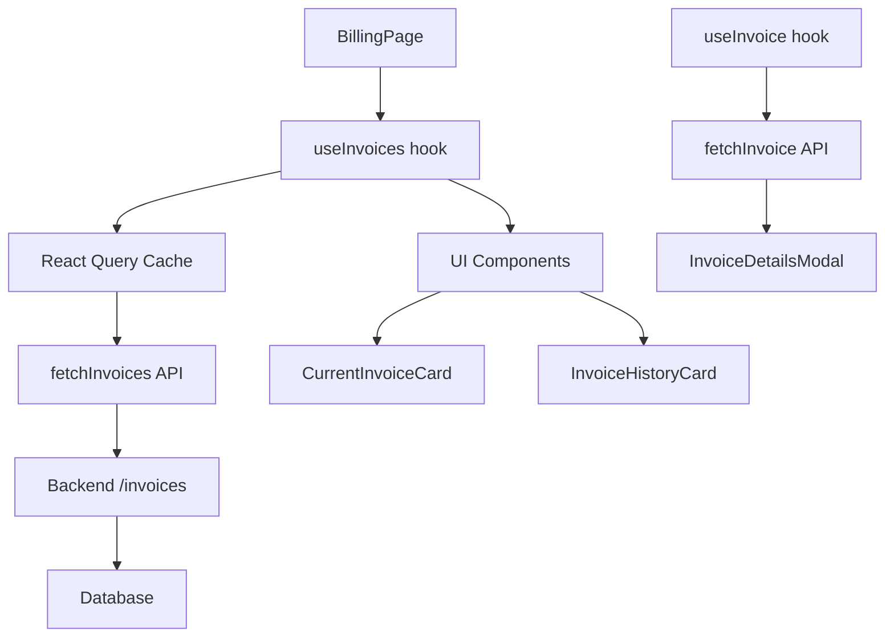

# Guide React Query - Staka-livres Frontend

## 📖 Vue d'ensemble

Ce guide documente l'implémentation de **React Query v3** dans le système de facturation de Staka-livres, remplaçant les appels API manuels par une solution de cache intelligente.

## 🎯 Objectifs atteints

- ✅ **Cache intelligent** : Données en cache 5-10 minutes
- ✅ **États optimisés** : `isLoading`, `isFetching`, `error`
- ✅ **Performance** : Navigation instantanée, background refresh
- ✅ **UX fluide** : Pagination sans blocage, retry automatique
- ✅ **Code maintenable** : Hooks réutilisables et typés

## 🏗️ Architecture

### Structure des fichiers

```
frontend/src/
├── main.tsx                 # QueryClientProvider configuré
├── hooks/
│   └── useInvoices.ts      # Hooks React Query pour factures
├── utils/
│   └── api.ts              # Services API (fetchInvoices, downloadInvoice)
├── pages/
│   └── BillingPage.tsx     # Page utilisant les hooks
└── components/billing/     # Composants d'affichage
```

### Flux de données



## 🔧 Configuration

### QueryClient Setup (main.tsx)

```typescript
import { QueryClient, QueryClientProvider } from "react-query";

const queryClient = new QueryClient({
  defaultOptions: {
    queries: {
      staleTime: 5 * 60 * 1000, // 5 minutes
      cacheTime: 10 * 60 * 1000, // 10 minutes
      retry: 2, // 2 tentatives
      refetchOnWindowFocus: false, // Pas de refetch au focus
    },
  },
});

<QueryClientProvider client={queryClient}>
  <App />
</QueryClientProvider>;
```

### API Services (utils/api.ts)

```typescript
// Types TypeScript stricts
export interface InvoiceAPI {
  id: string;
  amount: number;
  amountFormatted: string;
  createdAt: string;
  pdfUrl: string;
  commande: {
    id: string;
    titre: string;
    statut: string;
    description?: string;
  };
}

// Services avec gestion d'erreurs
export async function fetchInvoices(
  page = 1,
  limit = 10
): Promise<InvoicesResponse> {
  const response = await fetch(
    buildApiUrl(`/invoices?page=${page}&limit=${limit}`),
    {
      headers: getAuthHeaders(),
    }
  );

  if (!response.ok) {
    const errorData = await response.json().catch(() => ({}));
    throw new Error(errorData.error || `HTTP ${response.status}`);
  }

  return response.json();
}

export async function downloadInvoice(id: string): Promise<Blob> {
  const response = await fetch(buildApiUrl(`/invoices/${id}/download`), {
    headers: { Authorization: `Bearer ${localStorage.getItem("auth_token")}` },
  });

  if (!response.ok) throw new Error("Erreur téléchargement");
  return response.blob();
}
```

## 🎣 Hooks React Query

### useInvoices - Liste paginée

```typescript
export function useInvoices(page = 1, limit = 10) {
  return useQuery<InvoicesResponse, Error>(
    ["invoices", page, limit], // Query Key
    () => fetchInvoices(page, limit), // Query Function
    {
      keepPreviousData: true, // Important pour pagination
      staleTime: 5 * 60 * 1000,
      cacheTime: 10 * 60 * 1000,
      retry: 2,
      refetchOnWindowFocus: false,
    }
  );
}

// Usage dans composant
const { data, isLoading, error, isFetching } = useInvoices(page, 20);
```

### useInvoice - Détails d'une facture

```typescript
export function useInvoice(id: string) {
  return useQuery<InvoiceAPI, Error>(["invoice", id], () => fetchInvoice(id), {
    enabled: !!id, // Ne déclenche que si ID présent
    staleTime: 5 * 60 * 1000,
    cacheTime: 10 * 60 * 1000,
  });
}

// Usage conditionnel
const { data: detail } = useInvoice(selectedInvoiceId || "");
```

### useInvalidateInvoices - Invalidation cache

```typescript
export function useInvalidateInvoices() {
  const queryClient = useQueryClient();

  return () => {
    queryClient.invalidateQueries(["invoices"]);
  };
}

// Usage après paiement
const invalidateInvoices = useInvalidateInvoices();
const handlePaymentSuccess = () => {
  invalidateInvoices(); // Recharge les factures
};
```

## 📄 BillingPage Implementation

### Avant (Fetch manuel)

```typescript
// ❌ Ancien code avec fetch manuel
const [isLoading, setIsLoading] = useState(true);
const [invoices, setInvoices] = useState([]);

useEffect(() => {
  const loadInvoices = async () => {
    setIsLoading(true);
    try {
      const response = await fetch("/commandes");
      const data = await response.json();
      setInvoices(data.commandes);
    } catch (error) {
      console.error(error);
    } finally {
      setIsLoading(false);
    }
  };
  loadInvoices();
}, [page]);
```

### Après (React Query)

```typescript
// ✅ Nouveau code avec React Query
const {
  data: invoicesData,
  isLoading,
  error,
  isFetching,
} = useInvoices(page, 20);
const { data: selectedInvoiceDetail } = useInvoice(selectedInvoiceId || "");

// Traitement automatique des données
useEffect(() => {
  if (invoicesData?.invoices) {
    const transformedInvoices = invoicesData.invoices.map(
      mapInvoiceApiToInvoice
    );
    const pendingInvoices = transformedInvoices.filter(
      (inv) => inv.status === "pending"
    );
    const paidInvoices = transformedInvoices.filter(
      (inv) => inv.status === "paid"
    );

    setCurrentInvoice(pendingInvoices[0] || null);
    setInvoiceHistory(paidInvoices);
    setHasMore(invoicesData.pagination.hasNextPage);
  }
}, [invoicesData]);

// Gestion d'erreurs automatique
useEffect(() => {
  if (error) {
    showToast("error", "Erreur", error.message);
  }
}, [error, showToast]);
```

## 🎨 Gestion des États UI

### Loading States

```typescript
// Chargement initial
if (isLoading) {
  return <LoadingSpinner message="Chargement de vos factures..." />;
}

// Chargement pagination (background)
if (isFetching && !isLoading) {
  return <LoadingSpinner message="Chargement de plus de factures..." />;
}
```

### Error States

```typescript
// Gestion d'erreur avec retry
useEffect(() => {
  if (error) {
    showToast("error", "Erreur", error.message);
    // React Query retry automatiquement 2 fois
  }
}, [error]);
```

### Empty States

```typescript
if (!currentInvoice && invoiceHistory.length === 0 && !isLoading) {
  return (
    <EmptyState
      title="Aucune facture disponible"
      description="Créez votre première commande pour commencer !"
      action={{ label: "Créer une commande", onClick: () => {...} }}
    />
  );
}
```

## 📥 Téléchargement PDF

### Implémentation avec Blob

```typescript
const handleDownloadInvoice = async (invoiceId: string) => {
  try {
    showToast("info", "Téléchargement...", "Préparation de votre facture PDF");

    // API call avec auth
    const blob = await downloadInvoice(invoiceId);

    // Déclencher téléchargement
    const url = URL.createObjectURL(blob);
    const a = document.createElement("a");
    a.href = url;
    a.download = `facture-${invoiceId}.pdf`;
    document.body.appendChild(a);
    a.click();
    document.body.removeChild(a);
    URL.revokeObjectURL(url);

    showToast("success", "Téléchargé !", "Votre facture PDF a été téléchargée");
  } catch (error) {
    showToast("error", "Erreur de téléchargement", error.message);
  }
};
```

## 🔄 Pagination Optimisée

### Implémentation avec keepPreviousData

```typescript
const [page, setPage] = useState(1);
const { data, isLoading, isFetching } = useInvoices(page, 20);

const handleLoadMore = () => {
  if (hasMore && !isFetching) {
    setPage((prev) => prev + 1);
  }
};

// UI avec état disabled
<button
  onClick={handleLoadMore}
  disabled={isFetching}
  className={isFetching ? "opacity-50 cursor-not-allowed" : ""}
>
  {isFetching ? "Chargement..." : "Charger plus de factures"}
</button>;
```

## 🧪 Tests et Validation

### Tests manuels

1. **Navigation vers `/billing`**

   - ✅ Premier chargement : `isLoading = true`
   - ✅ Données affichées après succès
   - ✅ Cache fonctionne : navigation instantanée

2. **Pagination**

   - ✅ Clic "Charger plus" : `isFetching = true`
   - ✅ Anciennes données restent (`keepPreviousData`)
   - ✅ Nouvelles données ajoutées

3. **Gestion d'erreurs**

   - ✅ Token invalide : toast d'erreur
   - ✅ Retry automatique : 2 tentatives
   - ✅ Pas de crash application

4. **Téléchargement PDF**
   - ✅ Toast informatif
   - ✅ Appel API authentifié
   - ✅ Blob téléchargé
   - ✅ Fichier sauvegardé

### Tests avec devtools

```bash
# Installation DevTools (optionnel)
docker exec -it staka_frontend npm install react-query/devtools

# Dans App.tsx
import { ReactQueryDevtools } from 'react-query/devtools';
<ReactQueryDevtools initialIsOpen={false} />
```

### Script de test automatisé

```javascript
// Dans la console navigateur
billingTests.runAllTests();

// Tests individuels
billingTests.testReactQueryLoaded();
billingTests.testApiConfig();
billingTests.testBillingComponents();
```

## 🚀 Performance et Optimisations

### Cache Strategy

- **Stale Time**: 5 minutes → données considérées fraîches
- **Cache Time**: 10 minutes → données gardées en mémoire
- **Background Refetch**: Mise à jour silencieuse si stale
- **Deduplication**: Évite les requêtes doublons

### Memory Management

```typescript
// Cleanup automatique des queries inutilisées
const queryClient = new QueryClient({
  defaultOptions: {
    queries: {
      cacheTime: 10 * 60 * 1000, // 10 min puis garbage collected
    },
  },
});
```

### Bundle Size

React Query v3 ajoute ~50KB à l'application mais économise beaucoup de code custom.

## 🔮 Évolutions Futures

### Mutations

```typescript
// À implémenter pour les actions (paiement, etc.)
const mutation = useMutation(payInvoice, {
  onSuccess: () => {
    queryClient.invalidateQueries(["invoices"]);
    showToast("success", "Paiement réussi !");
  },
  onError: (error) => {
    showToast("error", "Erreur de paiement", error.message);
  },
});
```

### Optimistic Updates

```typescript
// Mise à jour optimiste avant confirmation serveur
const mutation = useMutation(updateInvoice, {
  onMutate: async (newData) => {
    await queryClient.cancelQueries(["invoices"]);
    const previousData = queryClient.getQueryData(["invoices"]);
    queryClient.setQueryData(["invoices"], (old) => ({ ...old, ...newData }));
    return { previousData };
  },
  onError: (err, newData, context) => {
    queryClient.setQueryData(["invoices"], context.previousData);
  },
});
```

### Real-time avec WebSockets

```typescript
// Synchronisation temps réel
useEffect(() => {
  const socket = io("/invoices");
  socket.on("invoice_updated", () => {
    queryClient.invalidateQueries(["invoices"]);
  });
  return () => socket.disconnect();
}, []);
```

## 🐛 Troubleshooting

### Erreurs communes

| Erreur                            | Cause             | Solution                    |
| --------------------------------- | ----------------- | --------------------------- |
| `Cannot read property 'invoices'` | Type incorrect    | Vérifier `InvoicesResponse` |
| `Query not enabled`               | Condition enabled | Vérifier `enabled: !!id`    |
| `403 Forbidden`                   | Token expiré      | Renouveler authentification |
| `PDF ne télécharge pas`           | Backend/S3        | Vérifier logs backend       |

### Debug

```javascript
// Console navigateur
window.__REACT_QUERY_CLIENT__.getQueryCache(); // Voir le cache
queryClient.invalidateQueries(["invoices"]); // Forcer reload
console.log("React Query State:", { data, isLoading, error });
```

## ✅ Checklist de Validation

### Configuration

- [ ] QueryClient configuré dans main.tsx
- [ ] react-query@3.39.3 installé
- [ ] Types TypeScript définis

### Hooks

- [ ] useInvoices fonctionne avec pagination
- [ ] useInvoice fonctionne pour les détails
- [ ] useInvalidateInvoices prêt pour mutations

### UI/UX

- [ ] Loading states gérés (isLoading vs isFetching)
- [ ] Error states avec toasts
- [ ] Empty states avec actions
- [ ] Pagination fluide

### Fonctionnalités

- [ ] Téléchargement PDF opérationnel
- [ ] Cache performance optimisée
- [ ] Navigation instantanée
- [ ] Retry automatique

---

**🎉 React Query est maintenant complètement intégré dans Staka-livres !**

Le système de facturation bénéficie d'une performance optimisée, d'une UX fluide et d'un code maintenable grâce à cette implémentation robuste.
