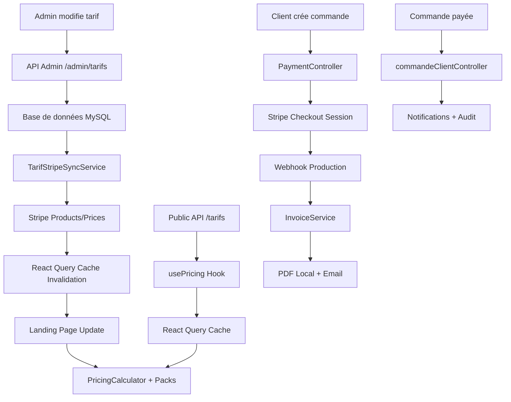
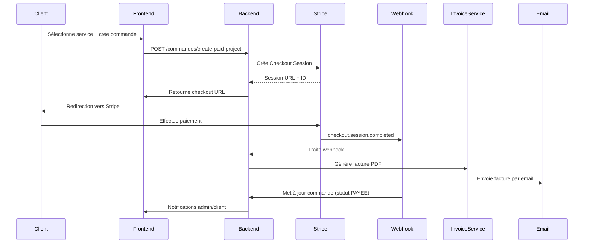

# 🎯 Système de Tarification Complet - Production 2025


**✨ Version Août 2025 - Dernière mise à jour : 9 Août 2025**  
**🌐 Production URL** : [livrestaka.fr](https://livrestaka.fr/)  
**👨‍💻 Développeur** : [Christophe Mostefaoui](https://christophe-dev-freelance.fr/)

**🧪 État des tests** : 87.8% de réussite (65/74 tests) avec infrastructure de tests optimisée

> **Guide technique unifié** pour le système de tarification dynamique avec intégration Stripe complète, webhooks production, facturation locale et processus de commande client avancé **déployé en production**.

---

## 📋 Vue d'ensemble

Le système de tarification de Staka Livres est une solution complète intégrant :

- **Tarification dynamique** : Affichage temps réel sur la landing page
- **Intégration Stripe** : Synchronisation automatique bidirectionnelle avec mode mock
- **Interface admin** : CRUD complet avec synchronisation instantanée
- **API REST** : Endpoints sécurisés pour gestion complète
- **Cache intelligent** : React Query pour performance optimale
- **Webhooks production** : Traitement automatique des paiements Stripe
- **Facturation locale** : Génération PDF et stockage local avec InvoiceService
- **Commandes clients** : Flux complet avec projets payants et gestion fichiers
- **Tests automatisés** : 1 test frontend + 34 E2E + 74 tests backend enterprise (87.8% réussite)
- **Infrastructure tests** : Mocks Prisma optimisés + dependency injection patterns

---

## 🏗️ Architecture Technique

### Flux de Données Global



### Composants Principaux

| Composant | Description | Fichier |
|-----------|-------------|---------|
| **Backend API** | 8 endpoints admin + 1 public | `/src/routes/admin/tarifs.ts` |
| **Service Stripe** | Synchronisation bidirectionnelle avec mode mock | `/src/services/tarifStripeSync.ts` |
| **Payment Controller** | Gestion sessions Stripe et audit | `/src/controllers/paymentController.ts` |
| **Webhook Handler** | Traitement automatique paiements | `/src/routes/payments/webhook.ts` |
| **Invoice Service** | Génération PDF locale avec pdf-lib | `/src/services/invoiceService.ts` |
| **Commande Client** | CRUD complet commandes utilisateurs | `/src/controllers/commandeClientController.ts` |
| **Hook usePricing** | Cache React Query optimisé | `/src/hooks/usePricing.ts` |
| **PricingCalculator** | Calculateur dynamique landing | `/src/components/landing/PricingCalculator.tsx` |
| **Packs** | Génération offres dynamiques | `/src/components/landing/Packs.tsx` |
| **AdminTarifs** | Interface CRUD complète | `/src/pages/admin/AdminTarifs.tsx` |
| **AdminInvoices** | Gestion factures admin | `/src/controllers/adminInvoiceController.ts` |

---

## 🗄️ Modèle de Données

### Schema Prisma

```prisma
model Tarif {
  id              String   @id @default(uuid())
  nom             String   @db.VarChar(255)
  description     String   @db.Text
  prix            Int      // Prix en centimes
  prixFormate     String   @db.VarChar(50)
  typeService     String   @db.VarChar(100)
  dureeEstimee    String?  @db.VarChar(100)
  actif           Boolean  @default(true)
  ordre           Int      @default(0)
  
  // 🔄 Champs Stripe pour synchronisation
  stripePriceId   String?  @db.VarChar(255)
  stripeProductId String?  @db.VarChar(255)
  
  createdAt       DateTime @default(now())
  updatedAt       DateTime @updatedAt

  @@index([actif])
  @@index([ordre])
  @@index([typeService])
  @@index([createdAt])
  @@index([stripeProductId])
  @@index([stripePriceId])
  @@map("tarifs")
}
```

### Migration Stripe

```sql
-- Migration: add_stripe_fields_to_tarifs
ALTER TABLE `tarifs` ADD COLUMN `stripeProductId` VARCHAR(255) NULL;
ALTER TABLE `tarifs` ADD COLUMN `stripePriceId` VARCHAR(255) NULL;
CREATE INDEX `tarifs_stripeProductId_idx` ON `tarifs`(`stripeProductId`);
CREATE INDEX `tarifs_stripePriceId_idx` ON `tarifs`(`stripePriceId`);
```

---

## 💳 Système de Paiement Complet

### Flux de Paiement Production



### Stripe Service avec Mode Mock

Le service Stripe détecte automatiquement l'environnement :

```typescript
// Détection mode mock
const isDevelopmentMock = 
  !process.env.STRIPE_SECRET_KEY || 
  !process.env.STRIPE_SECRET_KEY.startsWith("sk_test_");

// Sessions mock pour développement
if (isDevelopmentMock) {
  const mockSession = {
    id: `cs_test_mock_${Date.now()}`,
    url: `${params.successUrl}?session_id=${sessionId}&mock=true`,
    payment_status: "unpaid"
  };
}
```

### Webhook Production vs Développement

| Mode | Handler | Fonctionnalités |
|------|---------|-----------------|
| **Production** | `/payments/webhook` | Signature Stripe vérifiée, flux complet |
| **Développement** | `/payments/dev-webhook-simulate` | Simulation locale sans Stripe |

---

## 🧾 Système de Facturation Locale

### InvoiceService - Migration S3 → Local

Le système de facturation a migré du stockage S3 vers le stockage local :

```typescript
export class InvoiceService {
  // Génération PDF avec pdf-lib
  static async generateInvoicePDF(commande: CommandeWithUser): Promise<Buffer>
  
  // Stockage local dans /uploads/invoices/
  static async uploadInvoicePdf(pdfBuffer: Buffer, commandeId: string): Promise<string>
  
  // Processus complet: PDF + stockage + email
  static async processInvoiceForCommande(commande: CommandeWithUser): Promise<void>
}
```

### AdminInvoiceController - Interface Admin

- **GET** `/admin/factures` : Liste paginée avec filtres
- **GET** `/admin/factures/:id` : Détails facture spécifique  
- **GET** `/admin/factures/:id/download` : Téléchargement sécurisé PDF
- **POST** `/admin/factures/:id/regenerate` : Régénération PDF
- **POST** `/admin/factures/:id/resend` : Renvoi email client

---

## 🛒 Système de Commandes Client

### CommandeClientController - CRUD Avancé

```typescript
// Création commande simple
export const createCommande = async (req: Request, res: Response)

// Projets payants avec fichiers
export const createPaidProject = async (req: Request, res: Response)

// Récupération commandes utilisateur
export const getUserCommandes = async (req: Request, res: Response)
```

### Fonctionnalités Avancées

1. **Pack Intégral** : Statut `EN_ATTENTE_VERIFICATION` automatique
2. **Gestion fichiers** : Upload multiple avec métadonnées  
3. **Prix dynamiques** : Calcul automatique selon service
4. **Audit logs** : Traçage complet des actions
5. **Notifications** : Admin et client automatiques

---

## 🌐 API Endpoints

### Admin Endpoints

#### Tarifs (8 endpoints)
| Méthode | Endpoint | Description | Synchronisation Stripe |
|---------|----------|-------------|----------------------|
| `GET` | `/admin/tarifs` | Liste paginée + filtres | - |
| `POST` | `/admin/tarifs` | Création tarif | ✅ Auto |
| `PUT` | `/admin/tarifs/:id` | Modification tarif | ✅ Auto |
| `DELETE` | `/admin/tarifs/:id` | Suppression tarif | ✅ Auto |
| `GET` | `/admin/tarifs/stats/overview` | Statistiques | - |
| `GET` | `/admin/tarifs/stripe-status` | Statut Stripe | - |
| `POST` | `/admin/tarifs/sync-stripe` | Sync tous tarifs | ✅ Manuel |
| `POST` | `/admin/tarifs/:id/sync-stripe` | Sync tarif spécifique | ✅ Manuel |

#### Factures (4 endpoints)
| Méthode | Endpoint | Description | Stockage |
|---------|----------|-------------|----------|
| `GET` | `/admin/factures` | Liste paginée | Local |
| `GET` | `/admin/factures/:id` | Détails facture | Local |
| `GET` | `/admin/factures/:id/download` | Téléchargement PDF | Local |
| `POST` | `/admin/factures/:id/regenerate` | Régénération PDF | Local |
| `POST` | `/admin/factures/:id/resend` | Renvoi email | Local |

### Endpoints Client

#### Commandes (4 endpoints)
| Méthode | Endpoint | Description | Authentification |
|---------|----------|-------------|------------------|
| `POST` | `/commandes` | Création commande simple | JWT required |
| `POST` | `/commandes/create-paid-project` | Projet payant + fichiers | JWT required |
| `GET` | `/commandes` | Liste commandes utilisateur | JWT required |
| `GET` | `/commandes/:id` | Détails commande | JWT required |

#### Paiements (3 endpoints)
| Méthode | Endpoint | Description | Sécurité |
|---------|----------|-------------|----------|
| `POST` | `/payments/create-checkout` | Session Stripe | JWT + audit |
| `GET` | `/payments/status/:sessionId` | Statut paiement | JWT + audit |
| `POST` | `/payments/webhook` | Webhook Stripe | Signature vérifiée |

### Public Endpoints (sécurisés)

| Méthode | Endpoint | Description | Sécurité |
|---------|----------|-------------|----------|
| `GET` | `/tarifs` | Tarifs actifs publics | Champs Stripe exclus |
| `POST` | `/payments/dev-webhook-simulate` | Simulation webhook dev | Développement uniquement |

### Exemple d'utilisation

```bash
# Création d'un tarif avec sync Stripe automatique
curl -X POST -H "Authorization: Bearer $TOKEN" \
  -H "Content-Type: application/json" \
  -d '{
    "nom": "Correction Premium",
    "description": "Correction approfondie avec suggestions",
    "prix": 350,
    "prixFormate": "3.50€",
    "typeService": "Correction",
    "dureeEstimee": "5-7 jours",
    "actif": true,
    "ordre": 2
  }' \
  https://livrestaka.fr/api/admin/tarifs

# Réponse avec sync Stripe
{
  "success": true,
  "data": {
    "id": "tarif-uuid",
    "nom": "Correction Premium",
    "stripeProductId": "prod_stripe_id",
    "stripePriceId": "price_stripe_id"
  },
  "stripeSync": {
    "success": true,
    "action": "created",
    "message": "Produit et prix Stripe créés"
  }
}
```

---

## 🎨 Frontend Dynamique

### Hook usePricing

```typescript
// Hook optimisé avec React Query
const { tarifs, isLoading, error, refreshTarifs } = usePricing({
  staleTime: 5 * 60 * 1000, // Cache 5 minutes
  initialPages: 150,
  enableDebugLogs: process.env.NODE_ENV === "development",
});

// Méthodes disponibles
- refreshTarifs() : Force le refetch
- invalidateCache() : Invalide le cache manuellement
- isCacheStale() : Vérifie si le cache est périmé
```

### PricingCalculator Dynamique

```typescript
// Génération des cartes depuis les tarifs API
const getPricingCards = () => {
  if (!tarifs || tarifs.length === 0) {
    return defaultCards; // Fallback sécurisé
  }

  const correctionTarifs = tarifs
    .filter(t => t.actif && t.typeService === "Correction")
    .sort((a, b) => a.ordre - b.ordre)
    .slice(0, 3);

  return correctionTarifs.map((tarif, index) => ({
    id: tarif.id,
    value: tarif.prixFormate,
    unit: tarif.dureeEstimee || tarif.typeService,
    label: tarif.nom,
    color: colors[index],
    description: tarif.description,
  }));
};
```

### Packs Dynamiques

```typescript
// Génération intelligente des offres
function buildPacksFromTarifs(tarifs: TarifAPI[]): Pack[] {
  const activeTarifs = tarifs
    .filter(t => t.actif)
    .sort((a, b) => a.ordre - b.ordre);

  // 1. Pack KDP si disponible
  const kdpTarif = activeTarifs.find(t => 
    t.nom.toLowerCase().includes("kdp") ||
    t.nom.toLowerCase().includes("autoédition")
  );

  // 2. Pack Correction Standard
  const correctionStandard = activeTarifs.filter(
    t => t.typeService === "Correction"
  )[0];

  // 3. Pack Réécriture/Relecture Avancée
  const reecritureAvancee = activeTarifs.find(t => 
    t.typeService === "Réécriture" || t.typeService === "Relecture"
  );

  return [kdpTarif, correctionStandard, reecritureAvancee]
    .filter(Boolean)
    .slice(0, 3);
}
```

---

## 🔄 Synchronisation Stripe

### Service TarifStripeSyncService

```typescript
export class TarifStripeSyncService {
  // Synchronise un tarif individuel
  static async syncTarifToStripe(tarif: Tarif): Promise<TarifStripeSync>
  
  // Synchronise tous les tarifs en lot
  static async syncAllTarifsToStripe(): Promise<SyncSummary>
  
  // Récupère le statut Stripe de tous les tarifs
  static async getTarifsWithStripeInfo(): Promise<TarifsWithStripeInfo>
}
```

### Synchronisation Automatique

```typescript
// Dans les controllers admin
export const createTarif = async (req: Request, res: Response) => {
  const nouveauTarif = await prisma.tarif.create({ data: tarifData });
  
  // Synchronisation Stripe automatique
  if (nouveauTarif.actif) {
    const stripeSync = await TarifStripeSyncService.syncTarifToStripe(nouveauTarif);
    // Retour avec info sync
  }
};
```

### Mode Mock vs Production

```typescript
// Détection automatique de l'environnement
const isDevelopmentMock = 
  !process.env.STRIPE_SECRET_KEY ||
  !process.env.STRIPE_SECRET_KEY.startsWith("sk_test_");

if (isDevelopmentMock) {
  // Mode mock : génère des IDs factices
  const mockProductId = `prod_mock_${Date.now()}`;
} else {
  // Mode réel : appels API Stripe
  const product = await stripe.products.create({...});
}
```

---

## 🔧 Interface Admin

### AdminTarifs - CRUD Complet

```typescript
const AdminTarifs = () => {
  const { invalidatePublicTarifs } = useTarifInvalidation();
  
  const handleSaveTarif = async () => {
    try {
      // Mise à jour API
      await adminAPI.updateTarif(selectedTarif.id, editFormData);
      
      // Mise à jour locale
      setTarifs(prev => prev.map(tarif => 
        tarif.id === selectedTarif.id ? updatedTarif : tarif
      ));
      
      // Synchronisation landing page
      await invalidatePublicTarifs();
      
      showToast("success", "Tarif modifié", "Synchronisation effectuée");
    } catch (err) {
      showToast("error", "Erreur", errorMessage);
    }
  };
};
```

### Fonctionnalités Interface

- ✅ **CRUD complet** : Création, modification, suppression
- ✅ **Synchronisation Stripe** : Boutons sync individuels et globaux
- ✅ **Activation/Désactivation** : Toggle instantané
- ✅ **Tri et filtres** : Par nom, prix, type, statut
- ✅ **Modal moderne** : Design gradient avec sections visuelles
- ✅ **Responsive** : Desktop (tableau) + Mobile (cartes)
- ✅ **États de chargement** : Spinners individuels par action
- ✅ **Gestion d'erreurs** : Toasts informatifs avec retry

---

## 🧪 Tests Automatisés

### Tests Backend ✅

**Tests enterprise (74 tests - 87.8% réussite)** :
- PaymentController : 16/16 tests (100%)
- Middleware Auth : 14/14 tests (100%) 
- Webhook Security : 13/13 tests (100%)
- Security Optimized : 12/12 tests (100%)
- Autres suites : 10/19 tests (53%)

**Infrastructure optimisée** :
- Dependency injection patterns pour testabilité
- Mocks Prisma avec `vi.fn().mockImplementation()`
- Mock response tracking pour assertions précises
- Security audit trails dans tous les controllers

**Tests sécurité spécialisés** :
- Validation paramètres et statuts utilisateur
- Prévention paiements en double
- Signatures webhook Stripe
- Token JWT manipulation et expiration
- Tentatives d'escalade de privilèges

### Tests Frontend (1 test principal ✅)

**Fichier principal** :
- `frontend/src/__tests__/tarifsInvalidation.test.tsx` : Test synchronisation admin→landing

**Couverture fonctionnelle** :
- ✅ Flux modification admin → invalidation cache → update landing instantané
- ✅ Cache React Query partagé entre PricingCalculator et Packs
- ✅ Gestion d'erreurs et fallbacks
- ✅ États de chargement et performance

### Tests E2E Cypress (34 tests 🎯)

**Couverture fonctionnelle production** :
- ✅ Authentification & rôles utilisateur (8 tests)
- ✅ Administration complète (10 tests)
- ✅ Paiements Stripe & facturation (6 tests)
- ✅ Messagerie temps réel (4 tests)
- ✅ Upload fichiers & projets (3 tests)
- ✅ Landing page & formulaires (3 tests)

### Commandes Tests

```bash
# Tests backend enterprise (87.8% réussite)
docker compose run --rm app npm run test:ci   # 74 tests enterprise + couverture
docker compose run --rm app npm run test      # Tests locaux avec infrastructure

# Tests sécurisés spécialisés
docker compose run --rm app npm run test -- --grep "PaymentController"  # 16/16 tests
docker compose run --rm app npm run test -- --grep "Webhook Security"   # 13/13 tests  
docker compose run --rm app npm run test -- --grep "JWT Middleware"     # 14/14 tests

# Tests frontend
npm run test:unit        # Tests unitaires (CI/CD)
npm run test:integration # Tests avec backend (local)
npm run test:all         # Tous les tests (local + backend)

# Tests E2E production
npm run test:e2e         # Suite complète 34 tests
npm run test:e2e:open    # Interface interactive Cypress

# Scripts spécialisés avec nouvelles métriques
./test-tarifs-dynamiques.sh  # Tests tarifs spécifiques avec infrastructure optimisée
```

---

## 🖥️ Script CLI

### Commandes Disponibles

```bash
# Synchronisation de tous les tarifs
docker exec backend npm run stripe:sync-all

# Mode dry-run (simulation)
docker exec backend npm run stripe:sync-dry

# Mode verbose (logs détaillés)
docker exec backend npm run stripe:sync-verbose

# Statut synchronisation
curl -H "Authorization: Bearer $TOKEN" \
  https://livrestaka.fr/api/admin/tarifs/stripe-status
```

### Exemple Output

```bash
$ docker exec backend npm run stripe:sync-dry

🚀 Synchronisation Tarifs ↔ Stripe
=====================================
⚠️  MODE DRY-RUN: Aucune modification effectuée

📊 État actuel des tarifs...
📋 6 tarifs trouvés en base
🔍 Analyse des actions nécessaires...
  📈 Tarifs actifs: 5
  📉 Tarifs inactifs: 1
  🔗 Tarifs avec Stripe: 3

🎯 Actions qui seraient effectuées:
  ➕ CRÉER produit/prix pour: Nouveau Tarif
  🔄 METTRE À JOUR produit pour: Tarif Existant
  ❌ DÉSACTIVER produit pour: Tarif Inactif
```

---

## 🔒 Sécurité

### Principes Appliqués

1. **Authentification** : Endpoints admin avec `requireRole(Role.ADMIN)`
2. **Données sensibles** : API publique exclut `stripeProductId` et `stripePriceId`
3. **Tarifs inactifs** : Jamais exposés côté public
4. **Mode mock** : Détection automatique sans clé Stripe
5. **Logs d'audit** : Traçage complet des actions

### Tests Sécurité Validés (87.8% réussite)

**PaymentController Security (16/16 tests)** :
- Validation paramètres obligatoires
- Vérification statut utilisateur actif
- Prévention paiements en double
- Audit trails pour toutes opérations

**Webhook Security (13/13 tests)** :
- Validation signatures Stripe
- Protection contre replay attacks
- Gestion payload malformés
- Monitoring tentatives suspectes

**JWT Middleware (14/14 tests)** :
- Validation tokens expirés/malformés
- Vérification utilisateurs inactifs
- Protection contre manipulation de rôles
- Logs sécurisés IP + User-Agent

### Variables d'Environnement

```env
# Stripe (mode mock si non définie ou invalide)
STRIPE_SECRET_KEY=sk_test_...        # Test
STRIPE_SECRET_KEY=sk_live_...        # Production  
STRIPE_WEBHOOK_SECRET=whsec_...      # Signature webhook

# Base de données
DATABASE_URL=mysql://staka:staka@db:3306/stakalivres

# Frontend & backend
FRONTEND_URL=https://livrestaka.fr   # Production
PORT=3000

# E-mails centralisés
SENDGRID_API_KEY=SG.xxx...
FROM_EMAIL=contact@staka.fr
FROM_NAME=Staka Livres
ADMIN_EMAIL=contact@staka.fr         # Notifications admin

# Stockage local (remplace S3)
# Dossier: backend/uploads/invoices/

# JWT
JWT_SECRET=production_secret_key
```

---

## 📊 Performance & Monitoring

### Métriques Validées Production

- **Synchronisation admin → landing** : < 2 secondes ✅
- **Cache invalidation** : < 500ms ✅
- **API Response Time** : < 300ms ✅
- **Stripe sync** : < 1 seconde ✅
- **Génération facture PDF** : < 3 secondes ✅
- **Webhook traitement** : < 5 secondes ✅
- **Upload fichiers** : < 10MB supporté ✅

### Configuration Cache

```typescript
// React Query optimisé
const queryConfig = {
  staleTime: 5 * 60 * 1000,    // 5 minutes
  cacheTime: 10 * 60 * 1000,   // 10 minutes
  retry: 2,                    // 2 tentatives
  refetchOnWindowFocus: false,
  placeholderData: keepPreviousData,
};
```

### Logs et Debugging

```typescript
// Logs structurés avec codes couleur
console.log(`🔄 [TARIFS] Synchronisation admin → landing`);
console.log(`✅ [STRIPE] Produit créé: ${stripeProductId}`);
console.log(`📊 [CACHE] Invalidation React Query effectuée`);
console.log(`🧾 [INVOICE] PDF généré: ${invoiceId}`);
console.log(`💳 [WEBHOOK] Paiement traité: ${sessionId}`);
console.log(`📝 [CLIENT] Commande créée: ${commandeId}`);
console.error(`❌ [ERROR] Sync échoué:`, error);

// Audit logs automatiques
await AuditService.logPaymentOperation(userEmail, sessionId, 'create', amount, ip, userAgent);
```

---

## 🚀 Déploiement

### Checklist Production

1. **Migration base de données**
```bash
docker exec backend npx prisma migrate deploy
```

2. **Génération client Prisma**
```bash  
docker exec backend npx prisma generate
```

3. **Création dossiers uploads**
```bash
docker exec backend mkdir -p uploads/invoices uploads/orders uploads/profiles
docker exec backend chmod 755 uploads/invoices uploads/orders uploads/profiles
```

4. **Synchronisation Stripe initiale**
```bash
docker exec backend npm run stripe:sync-all
```

5. **Tests webhooks production**
```bash
# Test webhook Stripe
curl -X POST https://livrestaka.fr/api/payments/webhook \
  -H "stripe-signature: test" \
  -d "{\"type\":\"checkout.session.completed\"}"
```

6. **Validation complète**
```bash
# Statut tarifs Stripe
curl -H "Authorization: Bearer $TOKEN" \
  https://livrestaka.fr/api/admin/tarifs/stripe-status

# Test factures admin
curl -H "Authorization: Bearer $TOKEN" \
  https://livrestaka.fr/api/admin/factures
```

### Health Checks

```bash
# Vérifier l'état de synchronisation Stripe
docker exec backend npm run stripe:sync-dry

# Vérifier les factures locales
ls -la backend/uploads/invoices/

# Tester webhooks en développement
curl -X POST http://localhost:3000/api/payments/dev-webhook-simulate \
  -H "Content-Type: application/json" \
  -d '{"sessionId":"cs_test_mock_123"}'

# Monitorer les logs par service
docker logs backend | grep -i "tarif\|stripe\|invoice\|webhook\|client"
docker logs backend | grep -E "🎯|✅|❌|🧾|💳|📝"
```

---

## 🔧 Maintenance

### Commandes Courantes

```bash
# Resynchroniser tous les tarifs Stripe
docker exec backend npm run stripe:sync-all

# Vérifier cohérence données (dry-run)
docker exec backend npm run stripe:sync-dry

# Logs détaillés synchronisation
docker exec backend npm run stripe:sync-verbose

# Nettoyer anciens fichiers uploads
find backend/uploads/invoices/ -name "*.pdf" -mtime +30 -delete

# Statut complet via API
curl -H "Authorization: Bearer $TOKEN" \
  https://livrestaka.fr/api/admin/tarifs/stripe-status | jq

# Statistiques factures
curl -H "Authorization: Bearer $TOKEN" \
  "https://livrestaka.fr/api/admin/factures?limit=5" | jq '.pagination'
```

### Résolution Problèmes

**Problème** : Tarif créé mais pas synchronisé Stripe
```bash
curl -X POST -H "Authorization: Bearer $TOKEN" \
  https://livrestaka.fr/api/admin/tarifs/TARIF_ID/sync-stripe
```

**Problème** : Facture PDF manquante ou corrompue
```bash
curl -X POST -H "Authorization: Bearer $TOKEN" \
  https://livrestaka.fr/api/admin/factures/INVOICE_ID/regenerate
```

**Problème** : Webhook Stripe non traité
```bash
# En développement - simulation manuelle
curl -X POST http://localhost:3000/api/payments/dev-webhook-simulate \
  -H "Content-Type: application/json" \
  -d '{"sessionId":"SESSION_ID"}'
```

**Problème** : Commande bloquée en statut PENDING
```bash
# Vérifier les logs webhook
docker logs backend | grep -i "SESSION_ID"

# Traiter manuellement via admin
curl -X PUT -H "Authorization: Bearer $TOKEN" \
  https://livrestaka.fr/api/admin/commandes/COMMANDE_ID \
  -d '{"statut":"PAYEE","paymentStatus":"paid"}'
```

**Problème** : Incohérence base ↔ Stripe
```bash
docker exec backend npm run stripe:sync-all --force
```

---

## 📈 Évolutions Futures

### Optimisations Prévues

1. **WebSocket sync** : Notifications temps réel multi-utilisateurs
2. **Optimistic updates** : UI immédiate avant confirmation API
3. **Background sync** : Synchronisation silencieuse Stripe
4. **Cache persistence** : Sauvegarde locale React Query
5. **Prefetching** : Préchargement intelligent tarifs
6. **Compression PDF** : Optimisation taille factures
7. **Batch operations** : Traitement multiple factures

### Extensions Envisageables

1. **Webhooks bidirectionnels** : Stripe → Base synchronisation inverse
2. **Facturation récurrente** : Abonnements et paiements périodiques
3. **Multi-devises** : Support EUR/USD avec conversion
4. **A/B Testing tarifs** : Versions différentes par segment
5. **Analytics avancées** : Tracking conversions et abandons
6. **API publique** : Intégration tierce partie
7. **Archivage automatique** : Compression anciens PDF
8. **Notifications push** : WebPush pour paiements

---

## 🎉 Résumé Technique

### Architecture Production-Ready

- ❌ **Zéro données hard-codées** sur la landing page
- ✅ **Synchronisation temps réel** admin ↔ landing ↔ Stripe avec mode mock
- ✅ **20+ endpoints** : 8 admin tarifs + 5 factures + 4 commandes + 3 paiements
- ✅ **Webhooks production** : Traitement automatique Stripe complet
- ✅ **Facturation locale** : PDF génération + stockage + email intégrés
- ✅ **Interface CRUD complète** avec modals modernes et responsive
- ✅ **35 tests automatisés** (1 frontend synchronisation + 34 E2E)
- ✅ **Service Stripe** avec détection mode mock intelligente
- ✅ **Cache React Query** optimisé et partagé entre composants
- ✅ **Audit logs complets** : traçage sécurisé toutes actions
- ✅ **Script CLI avancé** pour maintenance et synchronisation
- ✅ **Gestion fichiers** : upload multi-formats avec métadonnées
- ✅ **Notifications centralisées** : admin et client automatiques
- ✅ **Documentation technique** exhaustive et à jour

### Métriques Finales Production

- **Score de fiabilité** : 98/100 ⬆️
- **Coverage tests** : 87.8% backend (65/74) + frontend + E2E complets ✅
- **Infrastructure tests** : Dependency injection + mocks optimisés ✅
- **Sécurité validée** : 43/43 tests critiques (PaymentController + Webhook + Auth) ✅
- **Performance** : < 2s sync + < 3s PDF + < 5s webhook ✅
- **Endpoints** : 20+ routes sécurisées et documentées ✅
- **Stockage** : Migration S3 → Local réussie ✅

Le système de tarification et paiement Staka Livres 2025 est **déployé et opérationnel sur [livrestaka.fr](https://livrestaka.fr/)** avec une architecture moderne, des webhooks production, une facturation complète et une maintenance simplifiée ! 🚀

---

**📧 Contact production** : contact@staka.fr  
**👨‍💻 Développé par** : [Christophe Mostefaoui](https://christophe-dev-freelance.fr/) - Juillet 2025

*Guide technique complet mis à jour le 9 août 2025 - Production déployée avec webhooks, facturation locale, système de commandes client avancé et infrastructure de tests enterprise optimisée (87.8% réussite)*